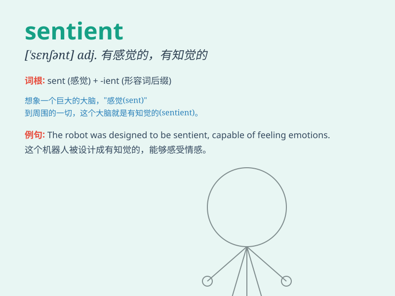

## sentient

**英音:** _[ˈsentiənt]_ **美音:** _[\'sɛntɪənt]_

**译义:**
*adj.有感觉力的,有感情的,感觉灵敏的,意识到的n.有知觉力的人*

### 短语

+ **sentient being:** _有感觉能力的生物_

+ **sentient creature:** _有感知力的生物_

+ **sentient entity:** _有感觉的实体_

+ **sentient life form:** _有知觉的生命形式_

+ **sentient intelligence:** _有感知的智能_

### 例句

#### 例句1

> **The sentient beings on this planet have diverse needs and
desires.**

**中文翻译:** 这个星球上的有感知能力的生物有着各种各样的需求和欲望。

**单词释义:** 有感知能力的

#### 例句2

> **Some philosophers believe that even plants can be considered
sentient to a certain extent.**

**中文翻译:**
一些哲学家认为甚至植物在一定程度上也可以被认为是有感知的。

**单词释义:** 有感知力的

#### 例句3

> **In science fiction, advanced aliens are often depicted as highly
sentient and intelligent life forms.**

**中文翻译:**
在科幻小说中，先进的外星人常常被描绘成高度有感知能力和智慧的生命形式。

**单词释义:** 有感觉力的

### 背诵小故事

> In a magical forest, there was a special creature. It could feel the
gentle wind and the warm sun. This creature was sentient, meaning it had
the ability to perceive and experience. It knew joy and sadness, just
like us.

**在一个神奇的森林里，有一个特别的生物。它能感受到轻柔的风和温暖的阳光。这个生物是有感觉能力的，意思是它有感知和体验的能力。它懂得快乐和悲伤，就像我们一样。**

### 图义

