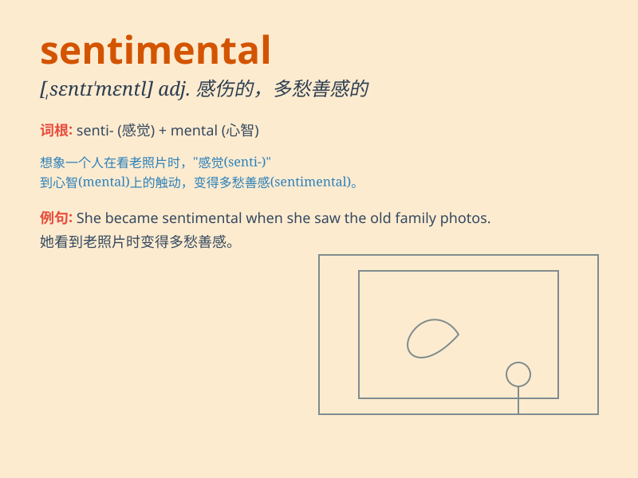

## sentimental

**英音:** _[sentɪ\'ment(ə)l]_ **美音:**
_[\'sɛntə\'mɛntl]_

**译义:** *adj.感伤性的,感情脆弱的*

### 短语

+ **sentimental value:** _情感价值；纪念价值_

+ **sentimental journey:** _伤感的旅行；怀旧之旅_

+ **sentimental attachment:** _情感依恋；眷恋_

+ **sentimental mood:** _多愁善感的情绪_

+ **sentimental music:** _抒情音乐；感伤的音乐_

### 例句

#### 例句1

> **She kept all the old love letters because she was
sentimental.**

**中文翻译:** 她保存着所有的旧情书，因为她多愁善感。

**单词释义:** 多愁善感的

#### 例句2

> **The movie was too sentimental for my taste.**

**中文翻译:** 这部电影对我来说太伤感了。

**单词释义:** 伤感的

#### 例句3

> **He has a sentimental attachment to his childhood home.**

**中文翻译:** 他对童年的家有着眷恋之情。

**单词释义:** 眷恋的；情感上的

### 背诵小故事

> A man always keeps an old letter from his first love. It makes him
sentimental. Every time he reads it, he remembers the sweet past. But he
knows it\'s just a memory.

**一个男人总是保存着初恋给他的一封旧信。这让他多愁善感。每次他读这封信，都会想起甜蜜的过去。但他知道这只是一段回忆。**

### 图义

