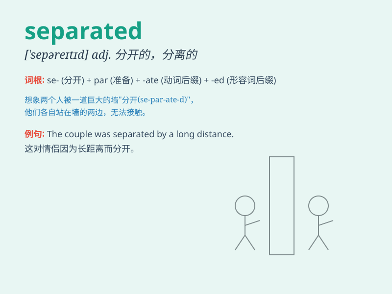

## separated

**英音:** _[ˈsepəreɪtɪd]_ **美音:** _[ˈsepəreɪtɪd]_

**译义:** *adj.分开的；分居的；不在一起生活的*

### 短语

+ **be separated from:** _与\...分离；和\...分开_

+ **separated couple:** _分居的夫妻_

+ **separated layer:** _分离层_

+ **separated system:** _分离系统_

+ **separated children:** _失散的儿童_

### 例句

#### 例句1

> **The couple has been separated for several months.**

**中文翻译:** 这对夫妻已经分居好几个月了。

**单词释义:** 分居；分开

#### 例句2

> **The children were separated into different groups for the
game.**

**中文翻译:** 孩子们为了游戏被分成了不同的小组。

**单词释义:** 分开；划分

#### 例句3

> **The two friends became separated in the crowd.**

**中文翻译:** 这两个朋友在人群中走散了。

**单词释义:** 走散；分离

### 背诵小故事

> A couple was separated by a big storm. They couldn\'t find each other
and were very sad. But finally, they met again when the storm ended.
\'Separated\' means being apart or divided.

**一对夫妇被一场大风暴分开了。他们找不到彼此，非常伤心。但最后风暴结束时他们又重逢了。'separated'意思是分开、分离。**

### 图义

