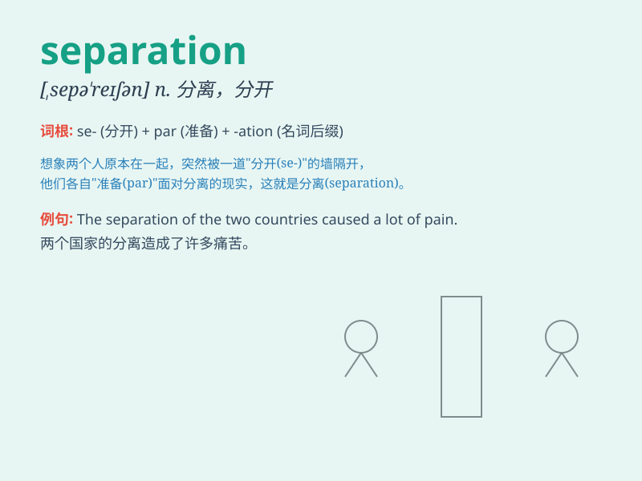

## separation

**英音:** _[sepə\'reɪʃ(ə)n]_ **美音:** _[,sɛpə\'reʃən]_

**译义:** *n.分离,分开*

### 短语

+ **separation anxiety:** _分离焦虑_

+ **job separation:** _离职；工作分离_

+ **separation agreement:** _分居协议_

+ **cell separation:** _细胞分离_

+ **magnetic separation:** _磁选；磁力分离_

### 例句

#### 例句1

> **The separation of powers is a fundamental principle of
democracy.**

**中文翻译:** 权力分立是民主的一项基本原则。

**单词释义:** 分离；分开；分隔

#### 例句2

> **The couple decided on a legal separation rather than a
divorce.**

**中文翻译:** 这对夫妇决定合法分居而不是离婚。

**单词释义:** 分居

#### 例句3

> **The separation between theory and practice is often wide.**

**中文翻译:** 理论和实践之间的分离往往很大。

**单词释义:** 分离；脱节

### 背诵小故事

> A king and his queen had a big fight, which led to their separation.
The king went to the east and the queen to the west. They were apart,
and this is what \'separation\' means - the act of being apart.

**一位国王和王后大吵了一架，这导致了他们的分离。国王去了东边，王后去了西边。他们分开了，这就是'separation'的意思------分离的行为。**

### 图义

