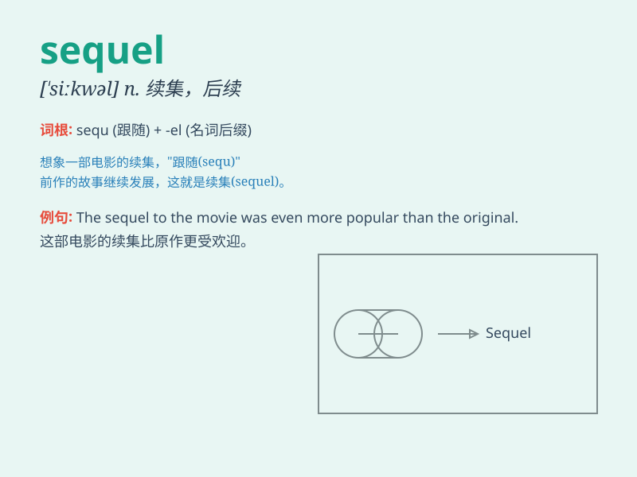

## sequel

**英音:** _[\'siːkw(ə)l]_ **美音:** _[\'sikwəl]_

**译义:** *n.结局*

### 短语

+ **in sequel:** _随后；结果_

+ **sequel to:** _\...\...的续集_

+ **the sequel of:** _\...\...的后续_

+ **a sequel for:** _为\...\...的续篇_

+ **write a sequel:** _写续集_

### 例句

#### 例句1

> **The sequel to the popular movie was highly anticipated.**

**中文翻译:** 这部热门电影的续集备受期待。

**单词释义:** 续集

#### 例句2

> **Her new novel is a sequel to her previous bestseller.**

**中文翻译:** 她的新小说是她之前畅销书的续篇。

**单词释义:** 续篇

#### 例句3

> **The sequel failed to live up to the expectations of the fans.**

**中文翻译:** 这部续集未能达到粉丝们的期望。

**单词释义:** 续集

### 背诵小故事

> A brave knight defeated a dragon. Years later, a new adventure began
as a sequel. People were excited to see what happened next. The sequel
was even more thrilling!

**一位勇敢的骑士打败了一条龙。多年后，新的冒险作为续集开始了。人们兴奋地想看看接下来会发生什么。这个续集甚至更令人激动！**

### 图义

