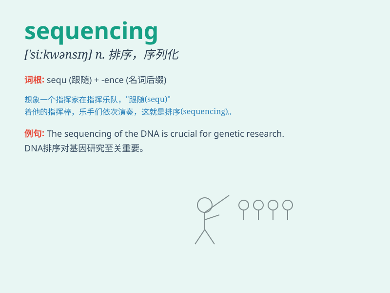

## sequencing

**英音:** _[ˌsɪːˈkwenʃɪŋ]_ **美音:** _[ˌsɪˈkwenshɪŋ]_

**译义:** *n.排序；序列测定（尤指DNA等）*

### 短语

+ **DNA sequencing:** _DNA 测序_

+ **protein sequencing:** _蛋白质测序_

+ **genome sequencing:** _基因组测序_

+ **sequencing technology:** _测序技术_

+ **next-generation sequencing:** _下一代测序_

### 例句

#### 例句1

> **The sequencing of the human genome was a major scientific
achievement.**

**中文翻译:** 人类基因组的测序是一项重大的科学成就。

**单词释义:** 排序；定序；测序

#### 例句2

> **The sequencing of events in the crime was crucial for the
investigation.**

**中文翻译:** 犯罪事件的先后顺序对调查至关重要。

**单词释义:** 先后顺序

#### 例句3

> **We need to do the sequencing of tasks to complete the project on
time.**

**中文翻译:** 我们需要对任务进行排序以按时完成项目。

**单词释义:** 排序

### 背诵小故事

> A scientist was sequencing the DNA of a mysterious plant. He spent
days and nights in the lab, carefully arranging and analyzing the
genetic code. Finally, he unlocked the secrets hidden in the sequencing
process.

**一位科学家正在对一种神秘植物的 DNA
进行测序。他在实验室里日夜工作，仔细排列和分析遗传密码。最终，他揭开了测序过程中隐藏的秘密。**

### 图义

