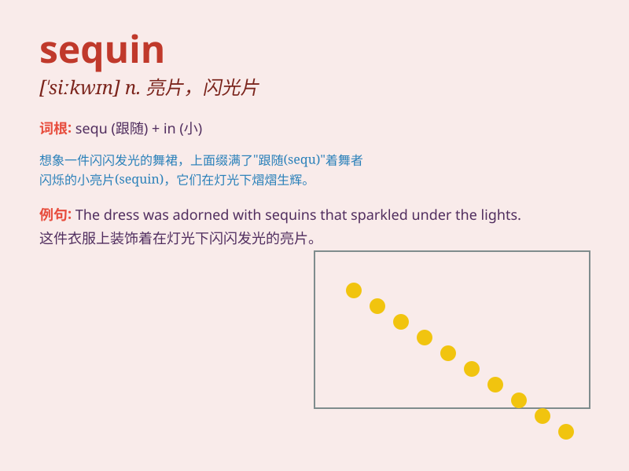

## sequin

**英音:** _[\'siːkwɪn]_ **美音:** _[\'sikwɪn]_

**译义:** *n.作衣服饰物用之小金属片,古威尼斯金币*

### 短语

+ **sequin dress:** _亮片连衣裙_

+ **sequin jacket:** _亮片夹克_

+ **sequin shoes:** _亮片鞋_

+ **sequin bag:** _亮片包_

+ **sequin scarf:** _亮片围巾_

### 例句

#### 例句1

> **She wore a dress adorned with sequins for the party.**

**中文翻译:** 她为聚会穿了一件缀满亮片的连衣裙。

**单词释义:** 亮片

#### 例句2

> **The sequins on the costume sparkled under the stage lights.**

**中文翻译:** 舞台灯光下，服装上的亮片闪闪发光。

**单词释义:** 亮片

#### 例句3

> **The designer added sequins to give the outfit a glamorous
touch.**

**中文翻译:** 设计师添加了亮片以使这套服装更具魅力。

**单词释义:** 亮片

### 背诵小故事

> A princess was going to a grand ball. Her dress was plain until she
sewed sequins on it. The shiny sequins made her the most beautiful at
the ball. Now you know sequin means a small shiny disk used for
decoration.

**一位公主准备去参加盛大的舞会。她的裙子原本很普通，直到她缝上了亮片。闪亮的亮片使她在舞会上成为最美丽的人。现在你知道
sequin 指的是用于装饰的小亮片。**

### 图义

