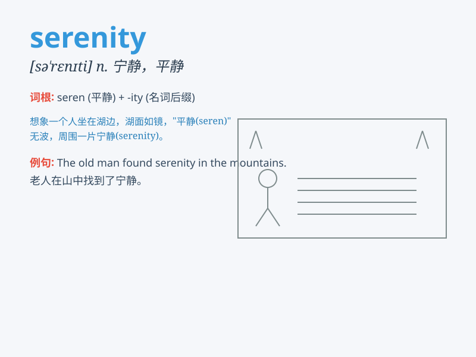

## serenity

**英音:** _[sə\'renəti]_ **美音:** _[sə\'renəti]_

**译义:** *n.平静*

### 短语

+ **inner serenity:** _内心的平静_

+ **serenity prayer:** _宁静祷文_

+ **ocean serenity:** _海洋的宁静_

+ **find serenity:** _找到宁静_

+ **serenity of mind:** _心灵的宁静_

### 例句

#### 例句1

> **The view of the mountains brought a sense of serenity to my
soul.**

**中文翻译:** 山的景色给我的心灵带来了一种宁静的感觉。

**单词释义:** 宁静

#### 例句2

> **She maintained her serenity even in the face of great
difficulties.**

**中文翻译:** 即使面对巨大的困难，她也保持着平静。

**单词释义:** 平静

#### 例句3

> **The garden was a place of serenity, away from the noise of the
city.**

**中文翻译:** 这个花园是一个宁静的地方，远离城市的喧嚣。

**单词释义:** 宁静

### 背诵小故事

> A traveler was lost in a chaotic forest. But when he reached a
peaceful lake surrounded by mountains, he felt serenity. The calm water
and quiet scenery made all his worries disappear.

**一位旅行者在混乱的森林中迷路了。但当他到达一个被群山环绕的宁静湖泊时，他感受到了宁静。平静的湖水和安静的景色让他所有的忧虑都消失了。**

### 图义

