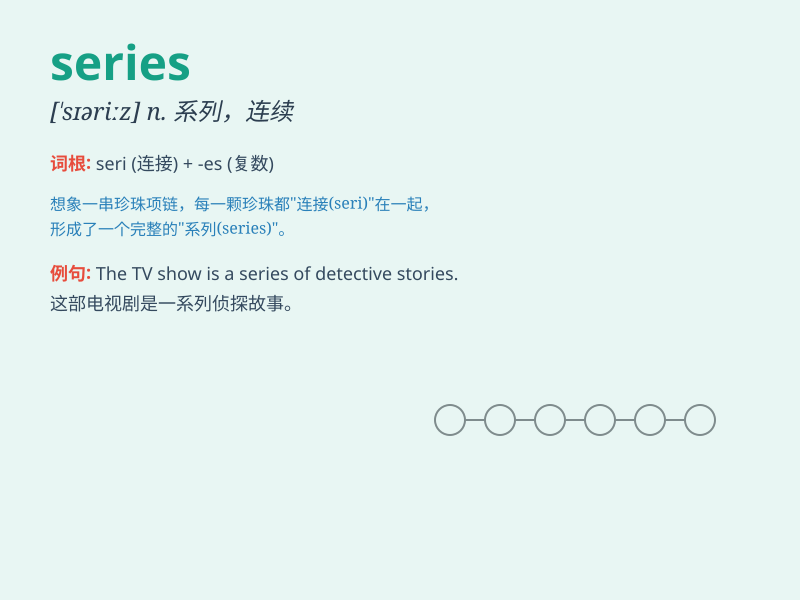

## series

**英音:** _[\'sɪəriːz; -rɪz]_ **美音:** _[\'sɪriz]_

**译义:** *n.连续,系列,丛书,级数*

### 短语

+ **a series of:** _一系列；一连串_

+ **in series:** _连续地；按顺序排列_

+ **time series:** _时间序列_

+ **data series:** _数据系列_

+ **convergent series:** _收敛级数_

### 例句

#### 例句1

> **The new TV series is very popular.**

**中文翻译:** 这部新的电视剧非常受欢迎。

**单词释义:** 系列；连续；丛书

#### 例句2

> **A series of accidents happened on the highway.**

**中文翻译:** 高速公路上发生了一连串的事故。

**单词释义:** 一连串；一系列

#### 例句3

> **The lecture series attracted many students.**

**中文翻译:** 这个系列讲座吸引了很多学生。

**单词释义:** 系列

### 背诵小故事

>
想象一下，你正在参加一场神秘的比赛，每次完成一个任务，就会得到一个奖章。这些奖章依次排列，形成了一连串（series）漂亮的装饰。这一连串的奖章就像
series 所代表的一系列、连续的事物。

**想象你参加比赛得奖章来理解 series 表示一系列、连续的事物**

### 图义

