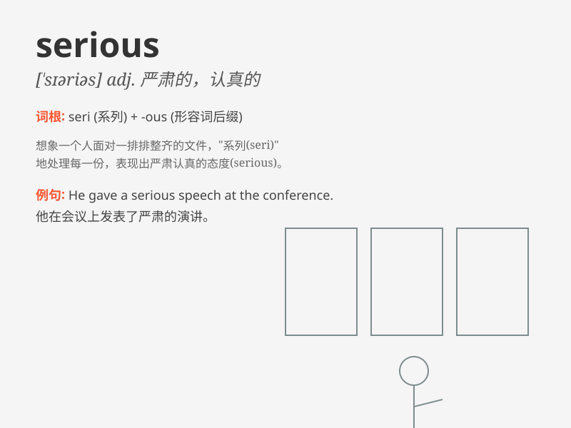

## serious

**英音:** _[\'sɪərɪəs]_ **美音:** _[\'sɪrɪəs]_

**译义:** *adj.严肃的,认真的,严重的*

### 短语

+ **serious illness:** _严重的疾病_

+ **serious problem:** _严重的问题_

+ **serious damage:** _严重的损害_

+ **serious crime:** _严重的罪行_

+ **serious look:** _严肃的表情_

### 例句

#### 例句1

> **He has a serious illness and needs immediate treatment.**

**中文翻译:** 他患了重病，需要立即治疗。

**单词释义:** 严重的

#### 例句2

> **She has a serious expression on her face.**

**中文翻译:** 她脸上表情严肃。

**单词释义:** 严肃的

#### 例句3

> **This is a serious matter that requires careful consideration.**

**中文翻译:** 这是一件严肃的事情，需要仔细考虑。

**单词释义:** 严肃的；重要的

### 背诵小故事

> One day, a little boy was very serious when he promised to take care
of his pet dog. He did everything carefully and never played tricks.
Because he knew it was a serious responsibility.

**一天，一个小男孩在承诺照顾他的宠物狗时非常认真。他做每件事都很仔细，从不捣蛋。因为他知道这是一项严肃的责任。**

### 图义

