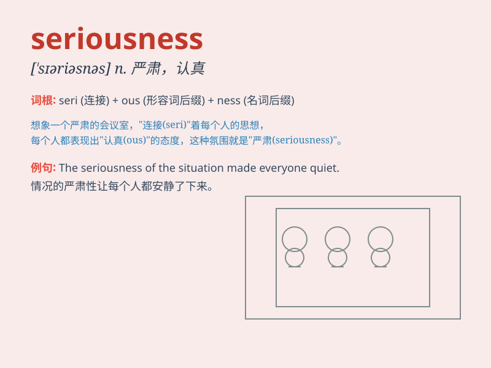

## seriousness

**英音:** _[\'sɪərɪəsnəs]_ **美音:** _[\'sɪrɪəsnəs]_

**译义:** *n.严肃,认真*

### 短语

+ **in all seriousness:** _非常严肃地；郑重其事地_

+ **the seriousness of the situation:** _局势的严重性_

+ **take sth. with seriousness:** _认真对待某事_

+ **a lack of seriousness:** _缺乏认真_

+ **treat a matter with the necessary seriousness:**
_以必要的认真态度对待一件事_

### 例句

#### 例句1

> **The seriousness of the situation became apparent when the
building started to collapse.**

**中文翻译:** 当建筑物开始倒塌时，情况的严重性变得明显了。

**单词释义:** 严重性

#### 例句2

> **He spoke with great seriousness about the need for reform.**

**中文翻译:** 他非常严肃地谈到了改革的必要性。

**单词释义:** 严肃；认真

#### 例句3

> **The doctor\'s expression showed the seriousness of the patient\'s
condition.**

**中文翻译:** 医生的表情显示出病人病情的严重性。

**单词释义:** 严重性

### 背诵小故事

> A scientist was working on a very important project. The seriousness
of the task made him focus all his time and energy. He knew one mistake
could lead to big problems. His dedication showed the true meaning of
seriousness.

**一位科学家正在从事一个非常重要的项目。任务的严肃性使他投入了所有的时间和精力。他知道一个错误就可能导致大问题。他的专注体现了'seriousness（严肃性；认真）'的真正含义。**

### 图义

