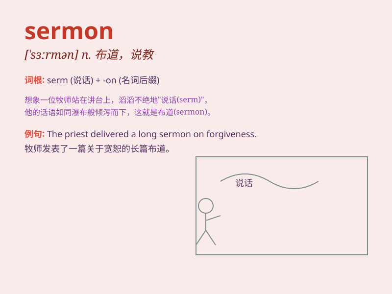

## sermon

**英音:** _[\'sɜːmən]_ **美音:** _[\'sɝmən]_

**译义:** *n.训诫,说教,布道*

### 短语

+ **preach a sermon:** _布道；讲道_

+ **deliver a sermon:** _发表讲道；进行说教_

+ **a sermon on morality:** _关于道德的讲道_

+ **Sunday sermon:** _主日讲道_

+ **inspiring sermon:** _鼓舞人心的讲道_

### 例句

#### 例句1

> **The priest delivered a powerful sermon on forgiveness.**

**中文翻译:** 这位牧师就宽恕做了一场有力的布道。

**单词释义:** 布道；讲道

#### 例句2

> **His sermon was full of wisdom and inspiration.**

**中文翻译:** 他的讲道充满了智慧和灵感。

**单词释义:** 讲道

#### 例句3

> **I found the sermon very moving and thought-provoking.**

**中文翻译:** 我觉得这次布道非常感人且发人深省。

**单词释义:** 布道

### 背诵小故事

>
在一个古老的教堂里，牧师正在发表一场重要的讲话，他的言辞充满智慧和启示，人们都聚精会神地聆听。这场精彩的讲话就像是一个\'sermon\'，给大家带来心灵的指引。

**在古老教堂中牧师充满智慧和启示的重要讲话，就像单词\'sermon\'所表示的布道、说教，给人心灵指引。**

### 图义

