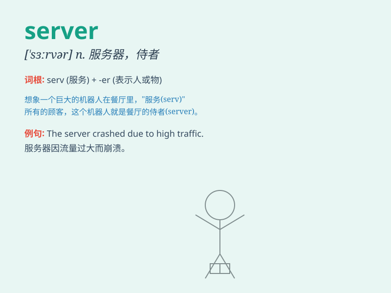

## server

**英音:** _[\'sɜːvə]_ **美音:** _[\'sɝvɚ]_

**译义:** *n.服务器*

### 短语

+ **file server:** _文件服务器_

+ **web server:** _网络服务器_

+ **database server:** _数据库服务器_

+ **print server:** _打印服务器_

+ **application server:** _应用服务器_

### 例句

#### 例句1

> **The server is down. We need to fix it as soon as possible.**

**中文翻译:** 服务器宕机了。我们需要尽快修复它。

**单词释义:** 服务器

#### 例句2

> **She works as a server in a restaurant.**

**中文翻译:** 她在一家餐馆当服务员。

**单词释义:** 服务员

#### 例句3

> **The tennis server has a powerful serve.**

**中文翻译:** 这位网球发球者发球有力。

**单词释义:** 发球者

### 背诵小故事

>
想象一下，在一个热闹的餐厅里，有一个忙碌的服务员（server），他总是快速地为顾客送上美食和饮料，满足大家的需求，就像电脑里的服务器快速为用户提供数据一样。

**想象在餐厅里忙碌的服务员，类比电脑中的服务器，帮助记忆单词\'server\'（服务器；服务员）**

### 图义

