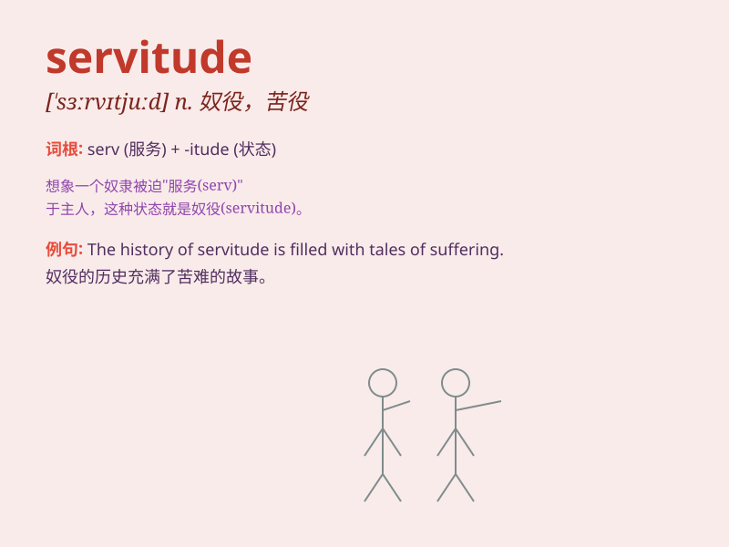

## servitude

**英音:** _[\'sɜːvɪtjuːd]_ **美音:** _[\'sɝvətud]_

**译义:** *n.奴隶状态,惩役,地役权,使用权*

### 短语

+ **bonded servitude:** _契约劳役_

+ **wage servitude:** _工资奴役_

+ **domestic servitude:** _家庭奴役_

+ **debt servitude:** _债务奴役_

+ **voluntary servitude:** _自愿奴役_

### 例句

#### 例句1

> **He was released from a life of servitude.**

**中文翻译:** 他从奴役的生活中被解放了出来。

**单词释义:** 奴役；劳役；苦役

#### 例句2

> **The peasants were kept in servitude by the landlords.**

**中文翻译:** 农民们被地主们置于奴役之下。

**单词释义:** 奴役；从属地位

#### 例句3

> **She endured years of servitude before finding freedom.**

**中文翻译:** 在找到自由之前，她忍受了多年的奴役。

**单词释义:** 奴役；束缚

### 背诵小故事

> A poor man was forced into servitude. He had to work long hours every
day without any rest, just like a slave. But he never gave up hope and
finally found a way to escape this painful life.

**一个可怜的人被迫处于奴役状态。他每天不得不长时间工作，没有任何休息，就像个奴隶。但他从未放弃希望，最终找到了逃离这种痛苦生活的方法。**

### 图义

