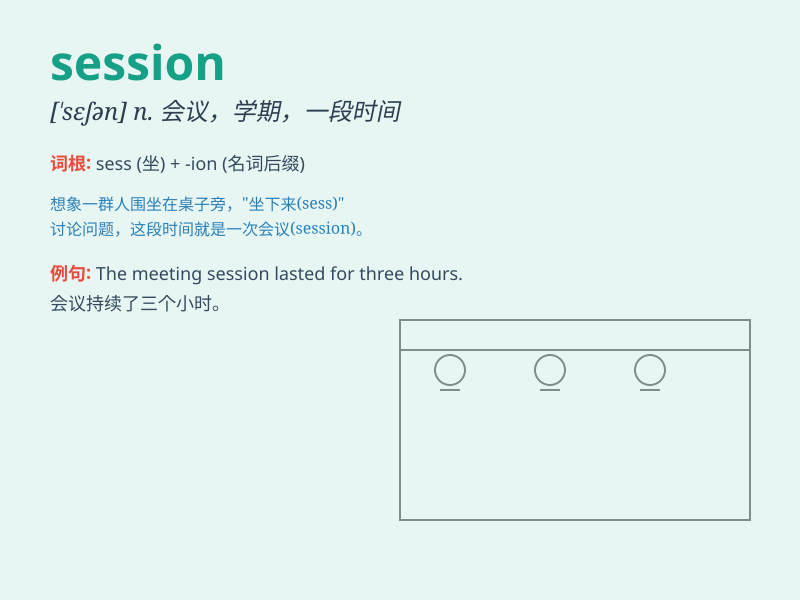

## session

**英音:** _[\'seʃ(ə)n]_ **美音:** _[\'sɛʃən]_

**译义:** *n.会议,开庭*

### 短语

+ **training session:** _培训课程；训练时段_

+ **business session:** _业务会议；商务会议_

+ **legislative session:** _立法会议；议会会期_

+ **therapy session:** _治疗过程；治疗时段_

+ **practice session:** _练习时段；练习课程_

### 例句

#### 例句1

> **The training session was very productive.**

**中文翻译:** 这次培训课程非常有成效。

**单词释义:** 课程；一段时间

#### 例句2

> **The parliamentary session is due to end on Friday.**

**中文翻译:** 议会会议将于星期五结束。

**单词释义:** 会议

#### 例句3

> **I had a therapy session with my psychologist yesterday.**

**中文翻译:** 我昨天和我的心理医生进行了一次治疗时段。

**单词释义:** 一段时间；一次

### 背诵小故事

> A group of students were having a study session. They sat together,
sharing ideas and solving problems. It was a productive time for all.
After the session, they felt they learned a lot.

**一群学生正在进行学习研讨。他们坐在一起，分享想法和解决问题。这对所有人来说都是一段富有成效的时光。研讨结束后，他们觉得学到了很多。**

### 图义

