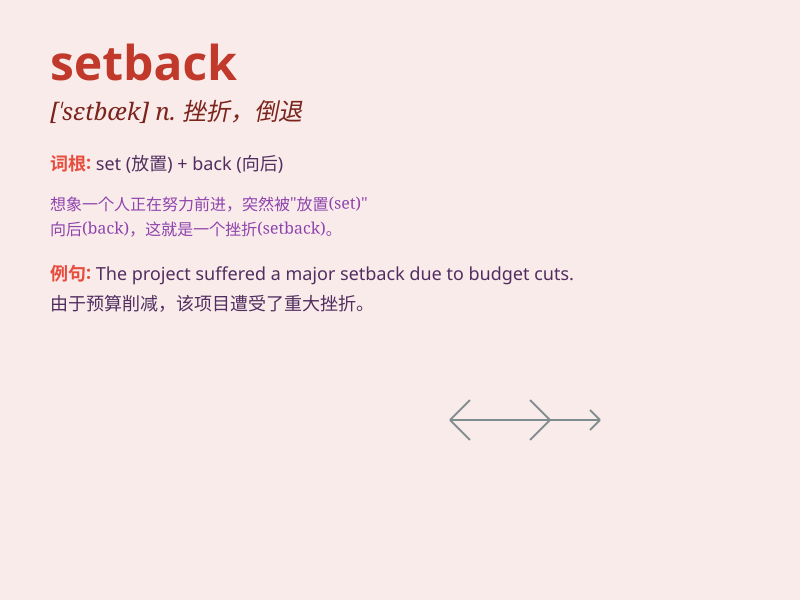

## setback

**英音:** _[\'setbæk]_ **美音:** _[\'sɛtbæk]_

**译义:** *n.顿挫,挫折,退步,逆流,(疾病的)复发*

### 短语

+ **major setback:** _重大挫折_

+ **suffer a setback:** _遭受挫折_

+ **economic setback:** _经济挫折_

+ **career setback:** _事业挫折_

+ **overcome a setback:** _克服挫折_

### 例句

#### 例句1

> **The bad weather was a major setback for our outdoor event.**

**中文翻译:** 恶劣的天气对我们的户外活动来说是一个重大的挫折。

**单词释义:** 挫折；阻碍

#### 例句2

> **The project suffered a setback due to lack of funds.**

**中文翻译:** 这个项目由于资金缺乏而遭受了挫折。

**单词释义:** 挫折；阻碍

#### 例句3

> **His illness was a serious setback to his career.**

**中文翻译:** 他的病对他的事业是一个严重的阻碍。

**单词释义:** 阻碍；妨碍

### 背诵小故事

> A brave climber was close to reaching the mountain peak. But
suddenly, a big rockfall was a setback. It blocked the way and made him
have to start again. Poor guy!

**一位勇敢的登山者快要到达山顶了。但突然，一场大的岩崩成了阻碍。它挡住了路，让他不得不重新开始。可怜的家伙！**

### 图义

