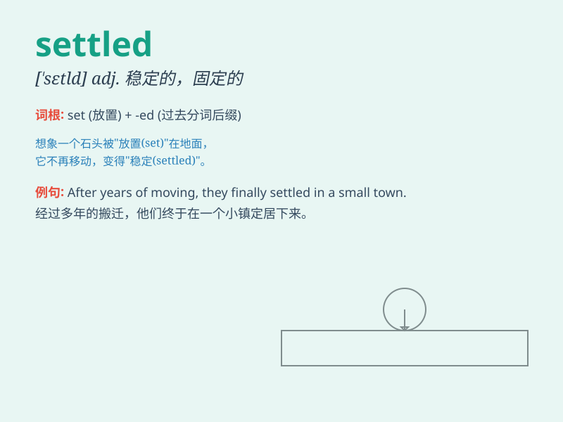

## settled

**英音:** _[\'setld]_ **美音:** _[\'sɛtld]_

**译义:** *adj.固定的*

### 短语

+ **settled down:** _定居；安定下来；平静下来_

+ **settled account:** _已结清的账户_

+ **settled life:** _安定的生活_

+ **settled law:** _既定法律_

+ **settled opinion:** _坚定的意见；固定的看法_

### 例句

#### 例句1

> **They finally settled in a small town.**

**中文翻译:** 他们最终在一个小镇定居下来。

**单词释义:** 定居

#### 例句2

> **The matter has been settled.**

**中文翻译:** 这件事已经解决了。

**单词释义:** 解决

#### 例句3

> **He settled down to read his book.**

**中文翻译:** 他安下心来读书。

**单词释义:** 安下心来

### 背诵小故事

> A bird was looking for a place to build its nest. After a long
search, it finally found a peaceful tree and settled there. It felt safe
and happy. Now it had a settled home.

**一只鸟在寻找筑巢的地方。经过长时间的寻找，它终于找到了一棵安静的树并在那里定居下来。它感到安全又开心。现在它有了一个安定的家。**

### 图义

