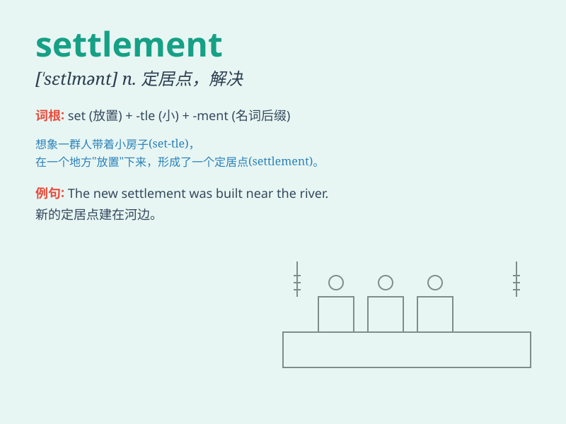

## settlement

**英音:** _[\'set(ə)lm(ə)nt]_ **美音:** _[\'sɛtlmənt]_

**译义:** *n.沉降,解决,结算,殖民,殖民地*

### 短语

+ **land settlement:** _土地开拓；土地垦殖_

+ **peace settlement:** _和平解决；和平协议_

+ **colonial settlement:** _殖民地定居点_

+ **urban settlement:** _城市聚落；城市定居点_

+ **out-of-court settlement:** _庭外和解_

### 例句

#### 例句1

> **The settlement of the dispute was reached after long
negotiations.**

**中文翻译:** 经过长时间的谈判，争端得到了解决。

**单词释义:** 解决；处理

#### 例句2

> **They built a new settlement on the edge of the desert.**

**中文翻译:** 他们在沙漠边缘建立了一个新的定居点。

**单词释义:** 定居点；殖民地

#### 例句3

> **The insurance company made a settlement with the claimant.**

**中文翻译:** 保险公司与索赔人达成了和解。

**单词释义:** 和解；协议

### 背诵小故事

> A group of brave pioneers traveled far and finally found a beautiful
land. They built houses, grew crops, and formed a settlement. It became
a peaceful and happy place for them to live.

**一群勇敢的开拓者长途跋涉，最终找到了一片美丽的土地。他们建造房屋、种植庄稼，并形成了一个定居点。这里成为了他们和平幸福的生活之地。**

### 图义

