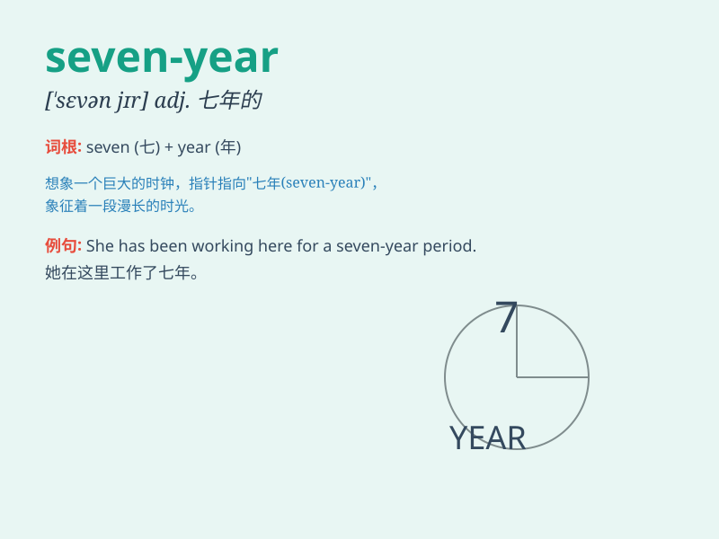

## seven-year

**英音:** _[\'sevn, jɪə]_ **美音:** _[\'sevn, jɪr]_

**译义:**
*七年的，持续七年的；每隔七年的（注：该词汇中year通常不单独使用，而是作为合成词的一部分）*

### 短语

+ **seven-year-old:** _七岁的_

+ **seven-year period:** _七年的时期_

+ **seven-year itch:** _七年之痒_

+ **seven-year plan:** _七年计划_

+ **seven-year guarantee:** _七年质保_

### 例句

#### 例句1

> **The seven-year-old boy is very smart.**

**中文翻译:** 这个七岁的男孩非常聪明。

**单词释义:** 七岁的

#### 例句2

> **She has a seven-year contract with the company.**

**中文翻译:** 她和这家公司签了一份七年的合同。

**单词释义:** 七年的

#### 例句3

> **The seven-year project finally came to an end.**

**中文翻译:** 这个七年的项目终于结束了。

**单词释义:** 七年的

### 背诵小故事

> Once upon a time, there was a magical tree that grew seven apples
every year. The children were so happy when they saw the seven-year
harvest. It was a wonderful sight!

**从前，有一棵神奇的树，每年都会结出七个苹果。当孩子们看到这七年一遇的丰收时，他们非常高兴。这是一幅美妙的景象！**

### 图义

