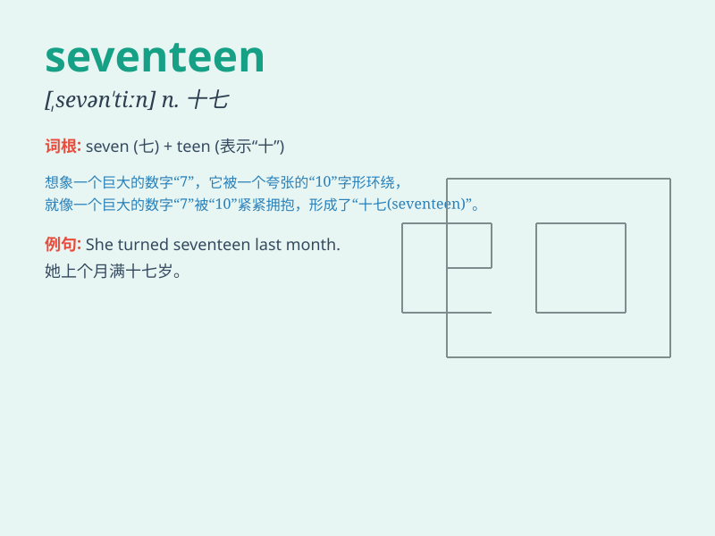

## seventeen

**英音:** _[sev(ə)n\'tiːn; \'sev(ə)ntiːn]_ **美音:**
_[,sɛvn\'tin]_

**译义:** * num.十七n.十七个*

### 短语

+ **seventeen years old:** _十七岁_

+ **at seventeen:** _在十七岁时_

+ **seventeen of them:** _他们中的十七个_

+ **about seventeen:** _大约十七_

+ **seventeen times:** _十七次_

### 例句

#### 例句1

> **I am seventeen years old.**

**中文翻译:** 我十七岁了。

**单词释义:** 十七

#### 例句2

> **There are seventeen students in the classroom.**

**中文翻译:** 教室里有十七个学生。

**单词释义:** 十七

#### 例句3

> **She bought seventeen apples at the market.**

**中文翻译:** 她在市场买了十七个苹果。

**单词释义:** 十七

### 背诵小故事

> One day, a little rabbit was celebrating its birthday. It was very
excited because it turned seventeen. It invited all its friends to a big
party and they had a wonderful time.

**一天，一只小兔子在庆祝它的生日。它非常兴奋，因为它满十七岁了。它邀请了所有的朋友来参加一个盛大的派对，他们度过了一段美好的时光。**

### 图义

