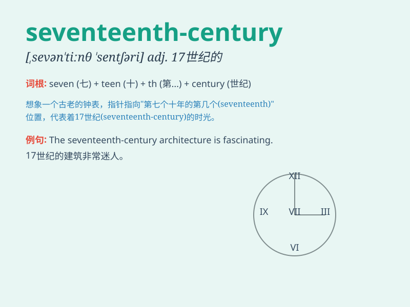

## seventeenth-century

**英音:** _[ˌsev(ə)nˈtiːnθ ˈsentʃəri]_ **美音:**
_[ˌsev(ə)nˈtiːnθ ˈsentʃəri]_

**译义:** *十七世纪的*

### 短语

+ **seventeenth-century art:** _十七世纪的艺术_

+ **seventeenth-century literature:** _十七世纪的文学_

+ **seventeenth-century architecture:** _十七世纪的建筑_

+ **seventeenth-century music:** _十七世纪的音乐_

+ **seventeenth-century philosophy:** _十七世纪的哲学_

### 例句

#### 例句1

> **The seventeenth-century painting is a masterpiece.**

**中文翻译:** 这幅 17 世纪的画是一幅杰作。

**单词释义:** 17 世纪的

#### 例句2

> **She studies seventeenth-century literature.**

**中文翻译:** 她研究 17 世纪的文学。

**单词释义:** 17 世纪的

#### 例句3

> **The seventeenth-century architecture is very distinctive.**

**中文翻译:** 17 世纪的建筑非常有特色。

**单词释义:** 17 世纪的

### 背诵小故事

> In the seventeenth-century, a brave adventurer set out on a long
journey. He faced many challenges but never gave up. This era was full
of mystery and adventure.

**在 17
世纪，一位勇敢的冒险家踏上了漫长的旅程。他面临许多挑战但从未放弃。这个时代充满了神秘和冒险。**

### 图义

