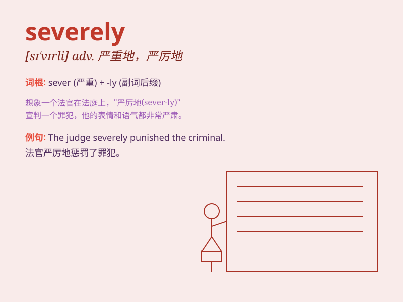

## severely

**英音:** _[sɪ\'vɪəlɪ]_ **美音:** _[sə\'vɪrli]_

**译义:** *adv.严格地,激烈地*

### 短语

+ **severely criticized:** _受到严厉批评_

+ **severely injured:** _严重受伤_

+ **severely punished:** _受到严厉惩罚_

+ **severely limited:** _受到严格限制_

+ **severely affected:** _受到严重影响_

### 例句

#### 例句1

> **The patient was severely ill and needed immediate medical
attention.**

**中文翻译:** 这位病人病得很重，需要立即就医。

**单词释义:** 严重地

#### 例句2

> **The company was severely criticized for its environmental
pollution.**

**中文翻译:** 这家公司因其环境污染受到了严厉的批评。

**单词释义:** 严厉地

#### 例句3

> **The earthquake severely damaged many buildings in the city.**

**中文翻译:** 地震严重损坏了这座城市的许多建筑。

**单词释义:** 严重地

### 背诵小故事

> Once upon a time, a brave knight was severely injured in a battle.
But with his strong will, he survived and recovered. \'Severely\' here
means very seriously or harshly.

**从前，一位勇敢的骑士在一场战斗中受了重伤。但凭借坚强的意志，他活了下来并康复了。'severely'在这里指的是非常严重地或严厉地。**

### 图义

