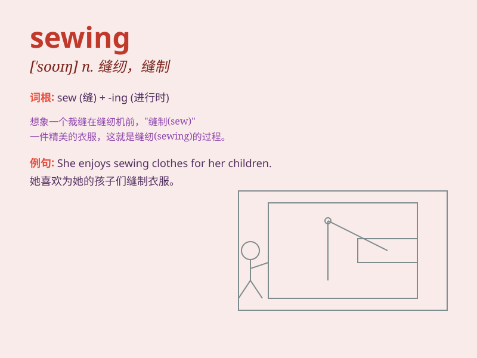

## sewing

**英音:** _[\'səʊɪŋ]_ **美音:** _[\'soɪŋ]_

**译义:** *n.裁缝,缝纫*

### 短语

+ **sewing machine:** _缝纫机_

+ **sewing kit:** _缝纫工具包_

+ **sewing thread:** _缝纫线_

+ **sewing skills:** _缝纫技能_

+ **sewing project:** _缝纫项目_

### 例句

#### 例句1

> **She is good at sewing and can make beautiful dresses.**

**中文翻译:** 她擅长缝纫，能做出漂亮的连衣裙。

**单词释义:** 缝纫

#### 例句2

> **The sewing machine broke down and needed to be repaired.**

**中文翻译:** 这台缝纫机坏了，需要修理。

**单词释义:** 缝纫（的动作）

#### 例句3

> **I spent the whole afternoon doing sewing.**

**中文翻译:** 我整个下午都在做缝纫活。

**单词释义:** 缝纫（的活动）

### 背诵小故事

> One day, Mary was sewing a beautiful dress. She carefully threaded
the needle and stitched the fabric. Her sewing skills made the dress
perfect. She was so proud of her sewing work.

**一天，玛丽正在缝一件漂亮的连衣裙。她小心地穿针引线，缝合布料。她的缝纫技术让这件裙子完美无缺。她为自己的缝纫工作感到非常自豪。**

### 图义

