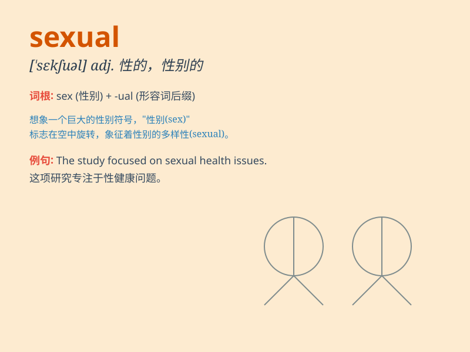

## sexual

**英音:** _[\'sekʃʊəl; -sjʊəl]_ **美音:** _[sɛkʃʊəl]_

**译义:** *adj.性的,性别的,[生]有性的*

### 短语

+ **sexual harassment:** _性骚扰_

+ **sexual orientation:** _性取向_

+ **sexual reproduction:** _有性生殖_

+ **sexual desire:** _性欲_

+ **sexual health:** _性健康_

### 例句

#### 例句1

> **Sexual harassment is a serious issue in the workplace.**

**中文翻译:** 性骚扰在工作场所是一个严重的问题。

**单词释义:** 性的；与性有关的

#### 例句2

> **She has a very open attitude towards sexual matters.**

**中文翻译:** 她对性方面的事情态度非常开放。

**单词释义:** 性的；与性有关的

#### 例句3

> **The book explores various aspects of sexual relationships.**

**中文翻译:** 这本书探讨了性关系的各个方面。

**单词释义:** 性的；与性有关的

### 背诵小故事

> A prince was charmed by a mysterious lady. But he later found out she
was only interested in his wealth, not in a true sexual relationship.
This made the prince very sad.

**一位王子被一位神秘的女士吸引。但后来他发现她只是对他的财富感兴趣，而不是真正的性关系。这让王子非常伤心。**

### 图义

