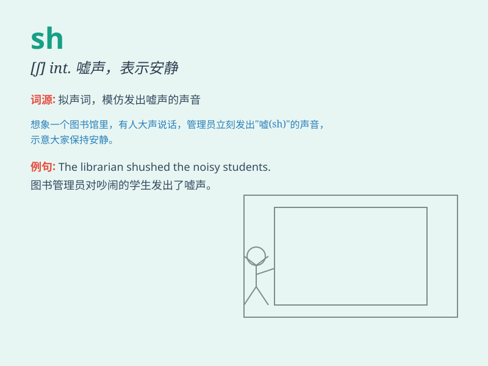

## sh

**英音:** _[ʃ]_ **美音:** _[ʃ]_

**译义:** *sh 是一个常见的英语缩写，通常用于表示 \'shop\'（商店）或
\'short\'（短的）等单词的缩写形式。此外，\'sh\'
也可以作为某些单词的拼写部分，如 \'shell\'（贝壳）或
\'ship\'（船）。在某些情况下，\'sh\' 也可以表示
\'shout\'（喊叫）的缩写。*

### 短语

+ **shout at:** _对\...\...大喊_

+ **shake hands:** _握手_

+ **show off:** _炫耀_

+ **shut up:** _闭嘴_

+ **shy away:** _（因害怕或信心不足而）退缩_

### 例句

#### 例句1

> **The wind made a shushing sound through the trees.**

**中文翻译:** 风在树林中发出沙沙声。

**单词释义:** 发出沙沙声

#### 例句2

> **She gave him a sh push to get him moving.**

**中文翻译:** 她轻轻推了他一下，让他动起来。

**单词释义:** 轻轻推

#### 例句3

> **The children were told to sh and be quiet.**

**中文翻译:** 孩子们被告知嘘声安静下来。

**单词释义:** 嘘（示意安静）

### 背诵小故事

> A shy sheep was standing under a big shady tree. It shook its body
and shouted, \'Sh, don\'t disturb me!\'

**一只害羞的绵羊站在一棵大的阴凉的树下。它摇晃着身体并喊道，'嘘，别打扰我！'**

### 图义

