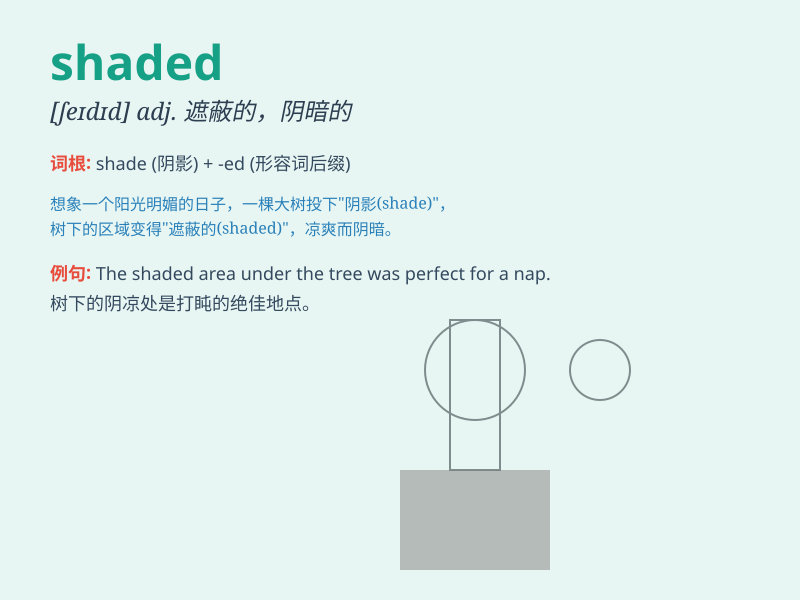

## shaded

**英音:** _[ˈʃeɪdɪd]_ **美音:** _[ˈʃeɪdɪd]_

**译义:**
*adj.有荫的,阴凉的；v.遮蔽(shade的过去式和过去分词形式）*

### 短语

+ **shaded area:** _阴影区域；阴凉处_

+ **shaded path:** _有阴影的小路_

+ **shaded garden:** _有树荫的花园_

+ **shaded corner:** _阴暗的角落_

+ **shaded eyes:** _被遮住光线的眼睛_

### 例句

#### 例句1

> **The park bench was located in a shaded area under the big
tree.**

**中文翻译:** 公园的长椅位于大树下的阴凉处。

**单词释义:** 阴凉的；背阴的

#### 例句2

> **She wore sunglasses to protect her eyes from the shaded
sunlight.**

**中文翻译:** 她戴着太阳镜以保护眼睛免受阴凉的阳光照射。

**单词释义:** 有阴影的；阴凉的

#### 例句3

> **The artist used shaded tones to create a sense of depth in the
painting.**

**中文翻译:** 这位艺术家使用了阴影色调来在这幅画中营造出一种深度感。

**单词释义:** 有阴影的；色调暗的

### 背诵小故事

> One hot summer day, I walked into a park and found a bench in the
shaded area. It was so cool and comfortable there. The trees provided
the shade, making me enjoy the moment.

**一个炎热的夏日，我走进一个公园，发现一张在阴凉处的长椅。那里非常凉爽舒适。树木提供了阴凉，让我享受那一刻。**

### 图义

