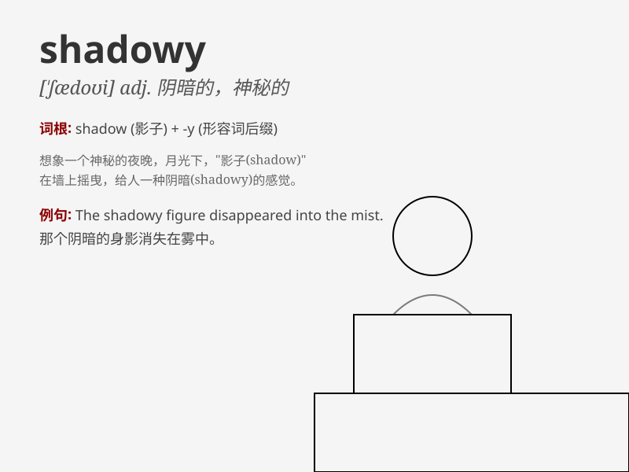

## shadowy

**英音:** _[\'ʃædəʊɪ]_ **美音:** _[\'ʃædoi]_

**译义:** *adj.有阴影的,多荫的,阴凉的*

### 短语

+ **shadowy figure:** _模糊的身影_

+ **shadowy corner:** _阴暗的角落_

+ **shadowy outline:** _模糊的轮廓_

+ **shadowy path:** _幽暗的小路_

+ **shadowy forest:** _阴暗的森林_

### 例句

#### 例句1

> **The figure moved in the shadowy corner of the room.**

**中文翻译:** 那个身影在房间昏暗的角落里移动。

**单词释义:** 昏暗的

#### 例句2

> **His past is rather shadowy.**

**中文翻译:** 他的过去相当模糊不清。

**单词释义:** 模糊的；朦胧的

#### 例句3

> **The shadowy outline of a mountain could be seen in the
distance.**

**中文翻译:** 远处可以看到一座山的朦胧轮廓。

**单词释义:** 朦胧的

### 背诵小故事

> In a dark forest, a shadowy figure moved silently among the trees. It
was hard to see clearly, creating a sense of mystery. Suddenly, a flash
of light revealed it was just a deer. The unclear and mysterious scene
made me remember \'shadowy\'.

**在一片黑暗的森林里，一个模糊的身影在树木间悄然移动。很难看清，营造出一种神秘的感觉。突然，一道闪光显示那只是一只鹿。这种不清楚和神秘的场景让我记住了'shadowy'（朦胧的；模糊的；阴暗的）。**

### 图义

