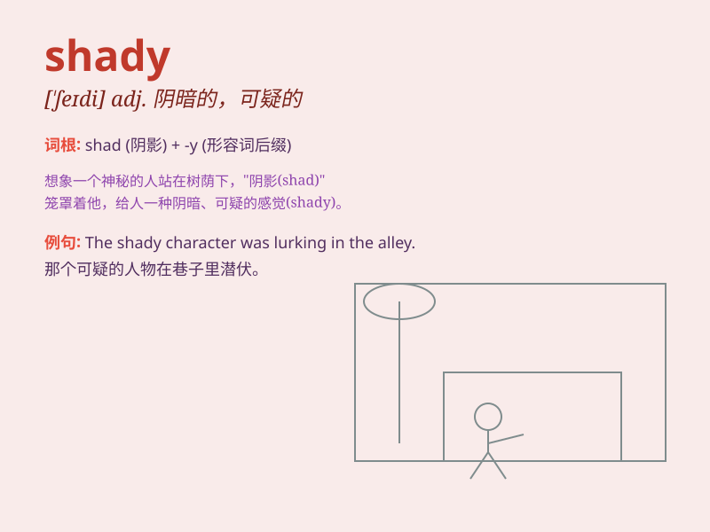

## shady

**英音:** _[\'ʃeɪdɪ]_ **美音:** _[\'ʃedi]_

**译义:** *adj.成荫的,多荫的,阴暗的*

### 短语

+ **shady business:** _不正当的生意_

+ **shady deal:** _可疑的交易_

+ **shady character:** _可疑的人物_

+ **shady tree:** _成荫的树_

+ **shady area:** _阴凉的区域_

### 例句

#### 例句1

> **The old man sat in the shady corner of the park.**

**中文翻译:** 这位老人坐在公园的阴凉角落里。

**单词释义:** 阴凉的

#### 例句2

> **He\'s involved in some shady business deals.**

**中文翻译:** 他卷入了一些不正当的商业交易。

**单词释义:** 不正当的；可疑的

#### 例句3

> **The street was lined with shady trees.**

**中文翻译:** 街道两旁种着成荫的树。

**单词释义:** 成荫的

### 背诵小故事

> A thief was always lurking in the shady corner of the street, waiting
to steal. One day, a brave policeman found him and said, \'You can\'t
hide in this shady place to do bad things!\'

**一个小偷总是潜伏在街道的阴暗角落，伺机偷窃。一天，一位勇敢的警察发现了他并说道：'你不能躲在这个阴暗的地方做坏事！'**

### 图义

