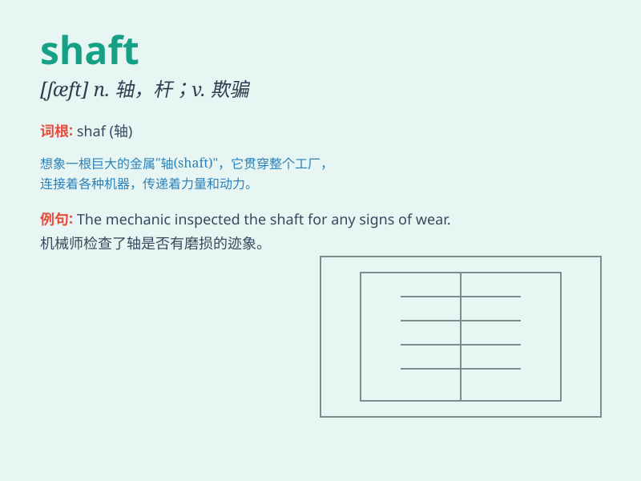

## shaft

**英音:** _[ʃɑːft]_ **美音:** _[ʃæft]_

**译义:** *n.轴,杆状物*

### 短语

+ **shaft of light:** _一束光_

+ **transmission shaft:** _传动轴_

+ **shaft wall:** _井壁_

+ **main shaft:** _主轴_

+ **shaft furnace:** _竖炉_

### 例句

#### 例句1

> **The elevator shaft was dark and narrow.**

**中文翻译:** 电梯井又黑又窄。

**单词释义:** 井状通道

#### 例句2

> **He held the golf club by the shaft.**

**中文翻译:** 他握住高尔夫球杆的杆身。

**单词释义:** 杆；柄；轴

#### 例句3

> **The miner descended into the shaft to start his work.**

**中文翻译:** 矿工下到矿井里开始工作。

**单词释义:** 矿井

### 背诵小故事

> A miner was working deep in the mine. Suddenly, a strong light shone
through a shaft. He realized it was a hope for escape. The shaft led him
to safety.

**一位矿工在矿井深处工作。突然，一道强光透过一个竖井照进来。他意识到这是逃生的希望。这个竖井带他走向了安全。**

### 图义

