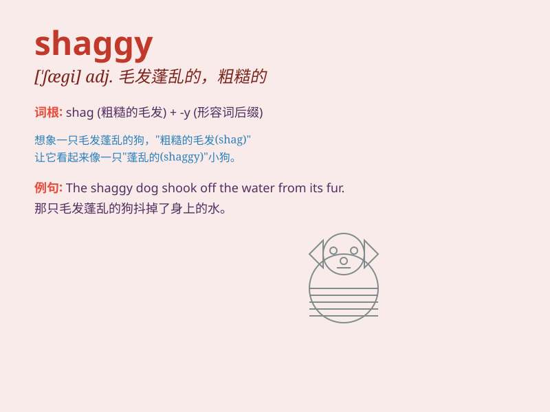

## shaggy

**英音:** _[\'ʃægɪ]_ **美音:** _[\'ʃægi]_

**译义:** *adj.毛发粗浓杂乱的,蓬松的,表面粗糙的*

### 短语

+ **shaggy dog:** _冗长而无聊的故事_

+ **shaggy hair:** _蓬乱的头发_

+ **shaggy beard:** _蓬乱的胡须_

+ **shaggy coat:** _毛茸茸的外套_

+ **shaggy eyebrows:** _浓密杂乱的眉毛_

### 例句

#### 例句1

> **The dog has a shaggy coat.**

**中文翻译:** 这只狗有一身蓬乱的毛。

**单词释义:** 蓬乱的；毛发粗浓而杂乱的

#### 例句2

> **He wore a shaggy sweater.**

**中文翻译:** 他穿着一件毛茸茸的毛衣。

**单词释义:** 毛茸茸的；长满蓬乱毛发的

#### 例句3

> **The shaggy man looked tired.**

**中文翻译:** 这个毛发蓬乱的男人看起来很疲惫。

**单词释义:** 毛发蓬乱的

### 背诵小故事

> One day, I saw a big dog with shaggy hair. Its fur was long and
messy, making it look very cute. The dog\'s shaggy appearance made it
stand out among the others.

**有一天，我看到一只大狗，毛发蓬松。它的毛又长又乱，看起来非常可爱。这只狗蓬乱的外表使它在其他狗中脱颖而出。**

### 图义

