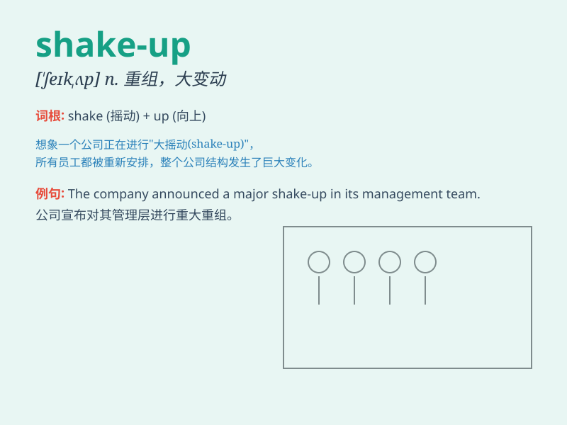

## shake-up

**英音:** _[ˈʃeɪk ʌp]_ **美音:** _[ˈʃeɪk ʌp]_

**译义:** *n. 重大调整；剧变；整顿*

### 短语

+ **major shake-up:** _重大变革_

+ **industry shake-up:** _行业大变动_

+ **corporate shake-up:** _公司整顿_

+ **political shake-up:** _政治变革_

+ **management shake-up:** _管理层变动_

### 例句

#### 例句1

> **The company is undergoing a major shake-up to improve
efficiency.**

**中文翻译:** 这家公司正在进行一次重大的整顿以提高效率。

**单词释义:** 重大变革；整顿

#### 例句2

> **The political shake-up has led to many changes in the
government.**

**中文翻译:** 这场政治变革导致了政府的许多变化。

**单词释义:** 变革；改组

#### 例句3

> **The new manager brought about a shake-up in the department\'s
working methods.**

**中文翻译:** 新经理对部门的工作方法进行了一次改革。

**单词释义:** 改革；调整

### 背诵小故事

> The company was in chaos until a major shake-up happened. A new boss
came and changed everything. Employees were moved around, and old rules
were shaken off. It was like a big earthquake, but in a good way.

**公司陷入混乱，直到一次重大的人事改组发生。新老板来了，改变了一切。员工岗位调动，旧规则被摒弃。这就像一场大地震，但却是往好的方向发展。**

### 图义

