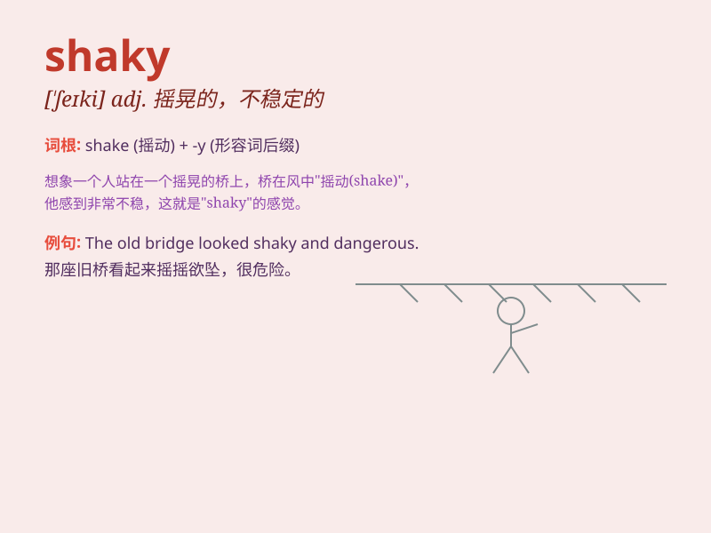

## shaky

**英音:** _[\'ʃeɪkɪ]_ **美音:** _[\'ʃeki]_

**译义:** *adj.虚弱的,颤抖的,不安的,不可靠的,震动的,摇晃的,动摇的*

### 短语

+ **shaky ground:** _不稳定的局面；危险的境地_

+ **shaky evidence:** _不可靠的证据_

+ **shaky hands:** _颤抖的双手_

+ **shaky voice:** _颤抖的声音_

+ **shaky memory:** _模糊的记忆；靠不住的记忆_

### 例句

#### 例句1

> **The table is shaky and might collapse at any moment.**

**中文翻译:** 这张桌子摇摇晃晃的，随时可能倒塌。

**单词释义:** 摇晃的；不稳定的

#### 例句2

> **Her voice was shaky as she told the story.**

**中文翻译:** 她讲故事时声音颤抖。

**单词释义:** 颤抖的；发抖的

#### 例句3

> **The economy remains shaky and needs further support.**

**中文翻译:** 经济仍然不稳定，需要进一步的支持。

**单词释义:** 不稳定的；不稳固的

### 背诵小故事

> A little monkey was trying to climb a shaky tree. Every time it
moved, the branches shook vigorously. The monkey was so scared that it
finally decided to give up. \'Shaky\' means not firm or unstable.

**一只小猴子试图爬上一棵摇晃的树。每次它一动，树枝就剧烈地摇晃。猴子非常害怕，最后决定放弃。\'shaky\'意思是不稳固的、摇晃的。**

### 图义

