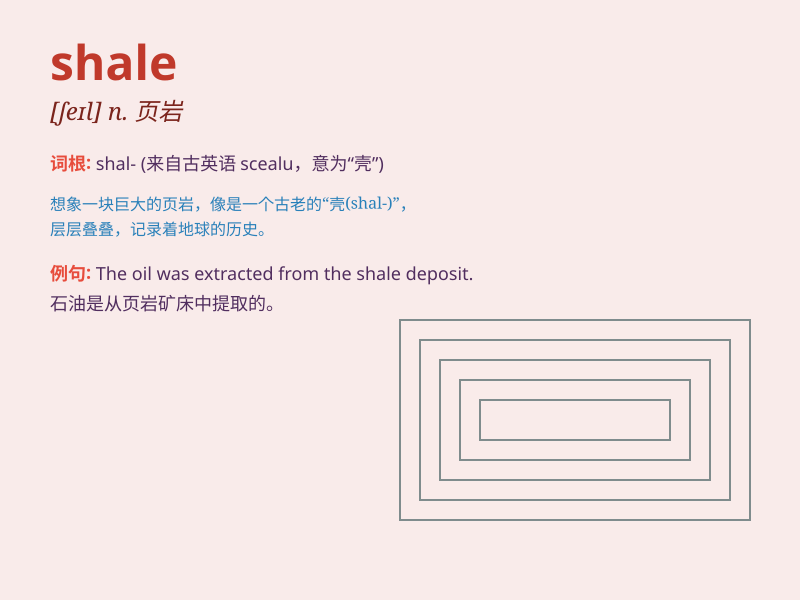

## shale

**英音:** _[ʃeɪl]_ **美音:** _[ʃel]_

**译义:** *n.[地]页岩,泥板岩*

### 短语

+ **oil shale:** _油页岩_

+ **shale gas:** _页岩气_

+ **black shale:** _黑色页岩_

+ **green shale:** _绿色页岩_

+ **marine shale:** _海相页岩_

### 例句

#### 例句1

> **The area is rich in shale deposits.**

**中文翻译:** 这个地区有丰富的页岩矿床。

**单词释义:** 页岩

#### 例句2

> **The shale cliffs are prone to erosion.**

**中文翻译:** 页岩峭壁容易受到侵蚀。

**单词释义:** 页岩

#### 例句3

> **They are extracting oil from shale.**

**中文翻译:** 他们正在从页岩中提取石油。

**单词释义:** 页岩

### 背诵小故事

> A miner was digging deep in the mountain. Suddenly, he found a layer
of strange rocks. He asked an expert and learned they were shale. The
miner was so excited as shale is valuable.

**一位矿工在山里深挖。突然，他发现了一层奇怪的岩石。他询问专家后得知它们是页岩。矿工非常兴奋，因为页岩很有价值。**

### 图义

