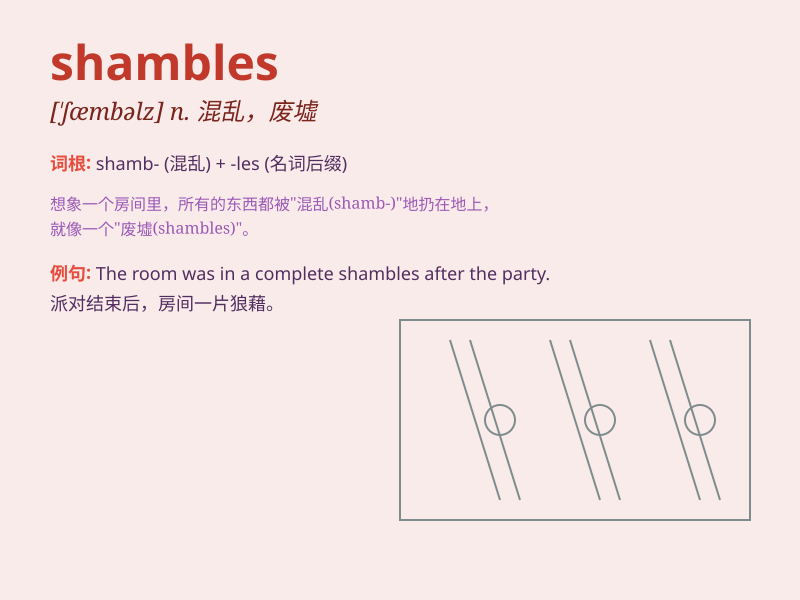

## shambles

**英音:** _[ˈʃæmblz]_ **美音:** _[ˈʃæmblz]_

**译义:** *n.肉店(市),屠宰场,混乱的地方,废墟*

### 短语

+ **in shambles:** _处于混乱状态；破败不堪_

+ **reduce to shambles:** _使沦为废墟；使陷入混乱_

+ **the shambles of war:** _战争的废墟；战争造成的混乱_

+ **shambles of a plan:** _混乱不堪的计划_

+ **city in shambles:** _处于混乱中的城市_

### 例句

#### 例句1

> **The market was in shambles after the storm.**

**中文翻译:** 暴风雨过后，市场一片混乱。

**单词释义:** 混乱；杂乱

#### 例句2

> **His room was in a complete shambles.**

**中文翻译:** 他的房间乱七八糟。

**单词释义:** 混乱；凌乱

#### 例句3

> **The economy is in shambles and needs urgent reform.**

**中文翻译:** 经济处于混乱状态，需要紧急改革。

**单词释义:** 混乱；破败

### 背诵小故事

> A man entered a market that was in a shambles. Tables were
overturned, goods scattered everywhere. It was a chaotic scene. He
realized \'shambles\' means a state of disorder and confusion.

**一个男人走进了一个混乱不堪的市场。桌子被掀翻，货物散落得到处都是。这是一片混乱的景象。他明白了'shambles'意思是混乱无序的状态。**

### 图义

