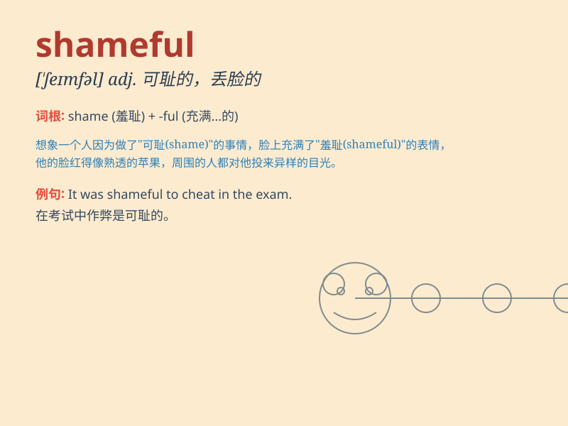

## shameful

**英音:** _[\'ʃeɪmfʊl; -f(ə)l]_ **美音:** _[\'ʃemfl]_

**译义:** * 不体面的*

### 短语

+ **shameful act:** _可耻的行为_

+ **shameful secret:** _可耻的秘密_

+ **shameful history:** _可耻的历史_

+ **shameful behavior:** _可耻的行为举止_

+ **shameful mistake:** _可耻的错误_

### 例句

#### 例句1

> **It is shameful to cheat in the exam.**

**中文翻译:** 在考试中作弊是可耻的。

**单词释义:** 可耻的

#### 例句2

> **His shameful behavior caused a lot of trouble.**

**中文翻译:** 他可耻的行为造成了很多麻烦。

**单词释义:** 可耻的

#### 例句3

> **This is a shameful waste of resources.**

**中文翻译:** 这是一种可耻的资源浪费。

**单词释义:** 可耻的

### 背诵小故事

> A thief was caught stealing in the market. His behavior was shameful.
Everyone looked at him with disgust. He felt so bad and decided to never
do such a bad thing again.

**一个小偷在市场偷东西被抓住了。他的行为是可耻的。每个人都厌恶地看着他。他感觉非常糟糕，并决定再也不做这样的坏事了。**

### 图义

