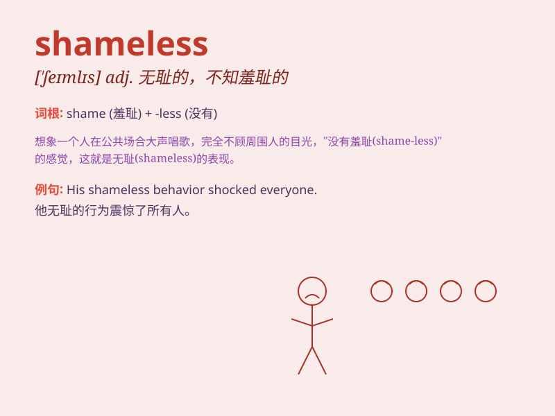

## shameless

**英音:** _[\'ʃeɪmlɪs]_ **美音:** _[\'ʃemləs]_

**译义:** *adj.不知羞耻的*

### 短语

+ **shameless behavior:** _无耻的行为_

+ **shameless lie:** _无耻的谎言_

+ **shameless flattery:** _无耻的奉承_

+ **shameless exploitation:** _无耻的剥削_

+ **shameless begging:** _无耻的乞讨_

### 例句

#### 例句1

> **He is a shameless liar.**

**中文翻译:** 他是个无耻的说谎者。

**单词释义:** 无耻的

#### 例句2

> **Her shameless behavior shocked everyone.**

**中文翻译:** 她无耻的行为震惊了所有人。

**单词释义:** 无耻的

#### 例句3

> **They made a shameless attempt to cheat.**

**中文翻译:** 他们无耻地企图作弊。

**单词释义:** 无耻的

### 背诵小故事

> A thief broke into a house and stole many things. When caught, he
showed no shame at all. This thief was truly shameless. He didn\'t care
about the harm he caused to others.

**一个小偷闯入一间房子并偷了很多东西。被抓住时，他一点也不感到羞愧。这个小偷真的是无耻。他不在乎给别人造成的伤害。**

### 图义

