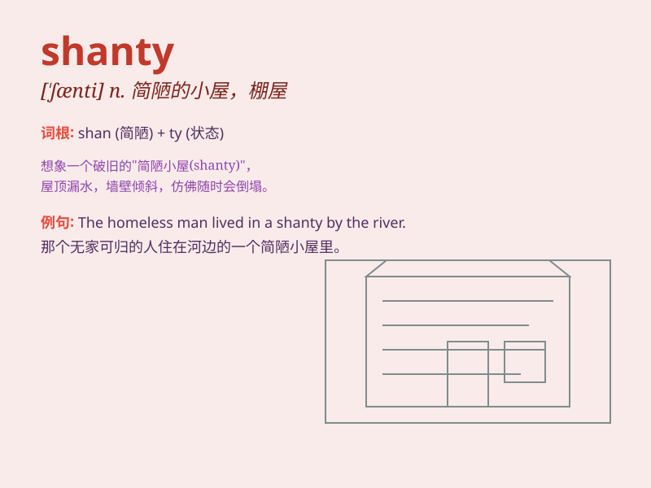

## shanty

**英音:** _[\'ʃæntɪ]_ **美音:** _[\'ʃænti]_

**译义:** *n.简陋小屋,棚屋*

### 短语

+ **shanty town:** _棚户区；贫民窟_

+ **fishing shanty:** _渔棚_

+ **shanty song:** _船工号子；劳动号子_

+ **shanty dweller:** _棚户区居民_

+ **old shanty:** _旧棚屋_

### 例句

#### 例句1

> **The fisherman lived in a small shanty by the sea.**

**中文翻译:** 这位渔夫住在海边的一个小棚屋里。

**单词释义:** 简陋的小屋

#### 例句2

> **They sang shanties while working on the ship.**

**中文翻译:** 他们在船上工作时唱着船夫曲。

**单词释义:** 船夫曲

#### 例句3

> **The old shanty was in a state of disrepair.**

**中文翻译:** 那座旧棚屋年久失修。

**单词释义:** 棚屋

### 背诵小故事

> 在海边的小渔村，有一间破旧的小屋，人们都叫它
shanty。每当暴风雨来临，它就摇摇欲坠。一天，一位画家来到这里，被这独特的
shanty 吸引，将它画了下来，让更多人知道了它。

**在海边小渔村的破旧小屋被称为'棚屋，简陋小屋'。每当暴风雨来临就摇摇欲坠。一天一位画家将其画下，让更多人知晓。**

### 图义

