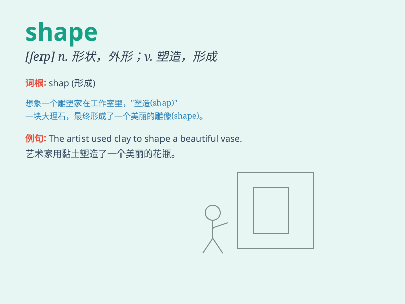

## shape

**英音:** _[ʃeɪp]_ **美音:** _[ʃep]_

**译义:**
*n.外形,形状,形态,(尤指女子的)体形,身段,形式vt.制作,定形,使成形,塑造,使符合vi.成形,形成,成长*

### 短语

+ **in shape:** _处于良好状态_

+ **out of shape:** _身体状况不佳；变形_

+ **take shape:** _形成；成形_

+ **give shape to:** _使成形；表达_

+ **a shape of:** _\...\...的形状_

### 例句

#### 例句1

> **The vase is in a strange shape.**

**中文翻译:** 这个花瓶形状奇特。

**单词释义:** 形状；外形

#### 例句2

> **Exercise helps shape your body.**

**中文翻译:** 锻炼有助于塑造你的身材。

**单词释义:** 塑造；使成形

#### 例句3

> **The artist is shaping the clay into a beautiful sculpture.**

**中文翻译:** 这位艺术家正在把黏土塑造成一件美丽的雕塑。

**单词释义:** 使成为......形状；塑造

### 背诵小故事

> One day, a little artist was trying to draw a beautiful picture. But
he didn\'t know what shape to give to his main character. Finally, he
decided on a heart shape, making the picture very charming.

**有一天，一位小艺术家正在试图画一幅美丽的画。但他不知道给他的主角赋予什么形状。最后，他决定用一个心形，使这幅画非常迷人。**

### 图义

