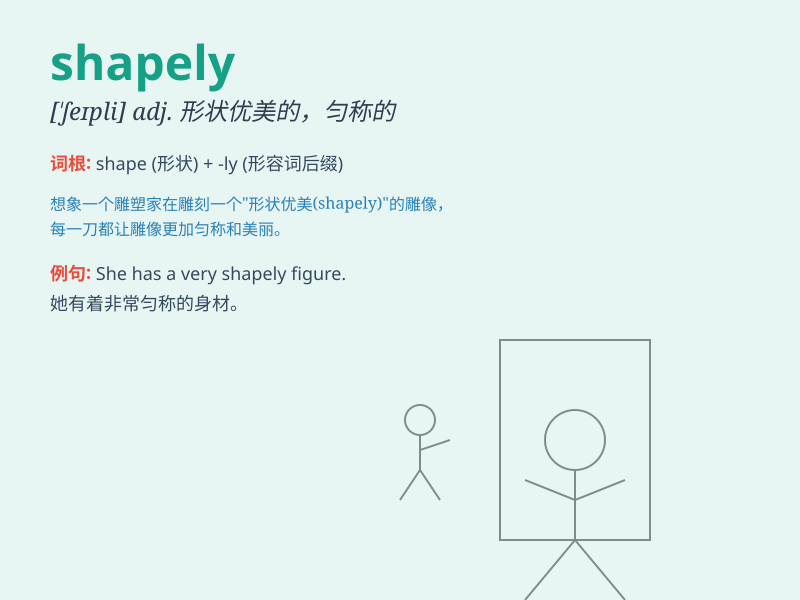

## shapely

**英音:** _[\'ʃeɪplɪ]_ **美音:** _[\'ʃepli]_

**译义:** *adj.样子好的,匀称的,形状美观的,定形的,有条理的*

### 短语

+ **shapely legs:** _匀称的腿_

+ **shapely figure:** _优美的身材_

+ **shapely curves:** _优美的曲线_

+ **shapely tree:** _形状优美的树_

+ **shapely vase:** _造型优美的花瓶_

### 例句

#### 例句1

> **She has shapely legs.**

**中文翻译:** 她有线条优美的双腿。

**单词释义:** 形状美观的；匀称的（形容腿部）

#### 例句2

> **The vase is shapely and elegant.**

**中文翻译:** 这个花瓶造型优美且典雅。

**单词释义:** 造型优美的（形容花瓶）

#### 例句3

> **The garden is filled with shapely trees.**

**中文翻译:** 花园里满是形状好看的树。

**单词释义:** 形状好看的（形容树）

### 背诵小故事

> A prince was seeking a shapely princess. He met many girls but none
had the perfect shape. Finally, he found a girl with a shapely figure
and they lived happily ever after.

**一位王子在寻找一位身材匀称的公主。他遇到了很多女孩，但没有一个有完美的身材。最后，他找到了一位身材匀称的女孩，从此他们过上了幸福的生活。**

### 图义

