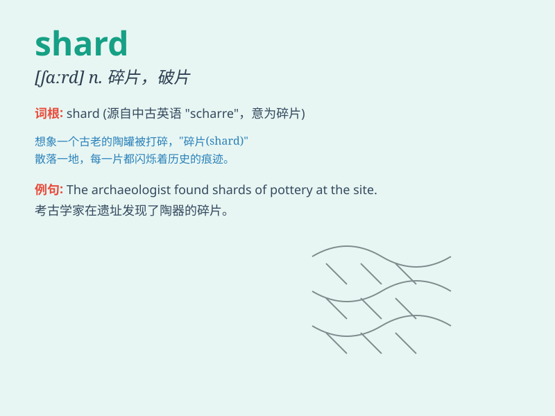

## shard

**英音:** _[ʃɑːd]_ **美音:** _[ʃɑrd]_

**译义:** *n.[瓷]碎片 破片*

### 短语

+ **shard of glass:** _玻璃碎片_

+ **pottery shard:** _陶器碎片_

+ **shard layer:** _碎片层_

+ **ancient shard:** _古代的碎片_

+ **shard collection:** _碎片收集_

### 例句

#### 例句1

> **The archaeologist found a shard of ancient pottery.**

**中文翻译:** 这位考古学家发现了一块古代陶器的碎片。

**单词释义:** 碎片

#### 例句2

> **A shard of glass cut his finger.**

**中文翻译:** 一片玻璃碎片割破了他的手指。

**单词释义:** 碎片

#### 例句3

> **The broken vase left shards all over the floor.**

**中文翻译:** 破碎的花瓶在地板上留下了到处都是的碎片。

**单词释义:** 碎片

### 背诵小故事

> A brave knight was exploring an ancient castle. In a hidden room, he
found a broken vase with sharp shards. He carefully picked up one shard
and saw beautiful patterns on it. It was a precious relic.

**一位勇敢的骑士正在探索一座古老的城堡。在一个隐藏的房间里，他发现了一个破碎的花瓶，上面有锋利的碎片。他小心地捡起一片碎片，看到上面有美丽的图案。这是一件珍贵的遗物。**

### 图义

