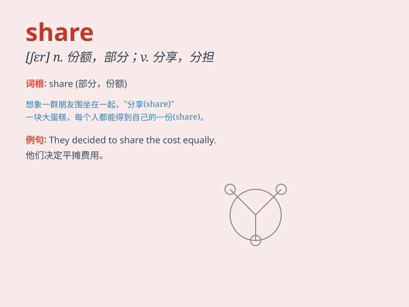

## share

**英音:** _[ʃeə]_ **美音:** _[ʃɛr]_

**译义:**
*n.共享,参与,一份,部分,份额,参股vt.分享,均分,共有,分配vi.分享*

### 短语

+ **share in:** _分享；分担_

+ **share out:** _分配；均分_

+ **share sth. with sb.:** _与某人分享某物_

+ **market share:** _市场份额_

+ **fair share:** _合理份额；公平分配_

### 例句

#### 例句1

> **We should share our happiness with friends.**

**中文翻译:** 我们应该和朋友们分享我们的快乐。

**单词释义:** 分享

#### 例句2

> **I share a room with my sister.**

**中文翻译:** 我和我妹妹合住一个房间。

**单词释义:** 共用；合用

#### 例句3

> **Let\'s share the cost of the meal.**

**中文翻译:** 咱们分摊餐费吧。

**单词释义:** 分摊；分担

### 背诵小故事

> One day, Tom and Jerry found a big cake. They decided to share it
equally. Tom cut the cake into two parts, and they both enjoyed their
share happily.

**一天，汤姆和杰瑞发现了一个大蛋糕。他们决定平均分享它。汤姆把蛋糕切成两部分，他们都开心地享用了自己的那份。**

### 图义

