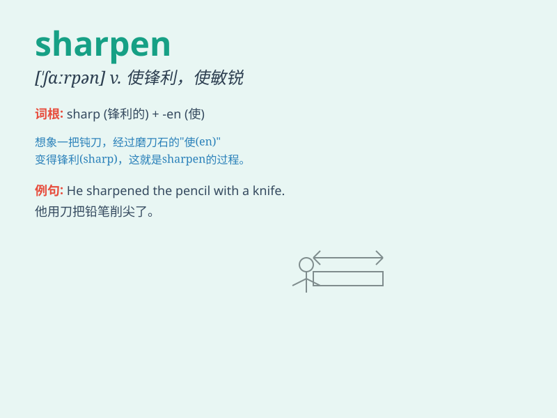

## sharpen

**英音:** _[\'ʃɑːp(ə)n]_ **美音:** _[\'ʃɑrpən]_

**译义:** *v.削尖,磨快,尖锐*

### 短语

+ **sharpen pencils:** _削铅笔_

+ **sharpen skills:** _提高技能_

+ **sharpen knives:** _磨刀_

+ **sharpen one\'s wits:** _使某人变得机智_

+ **sharpen the focus:** _使焦点更清晰_

### 例句

#### 例句1

> **He is sharpening the pencil with a knife.**

**中文翻译:** 他正在用小刀削铅笔。

**单词释义:** 使锋利；削尖

#### 例句2

> **This experience will sharpen your skills.**

**中文翻译:** 这次经历会提高你的技能。

**单词释义:** 使提高；使改进

#### 例句3

> **The training is designed to sharpen the minds of the
participants.**

**中文翻译:** 这项训练旨在使参与者思维敏锐。

**单词释义:** 使敏锐；使敏捷

### 背诵小故事

> One day, Tom found a blunt knife. He decided to sharpen it. He used a
whetstone and rubbed the knife back and forth. Finally, the knife became
sharp and could cut things easily.

**一天，汤姆发现了一把钝刀。他决定把它磨锋利。他用一块磨刀石，来回地摩擦这把刀。最后，这把刀变得锋利，可以轻松地切东西了。**

### 图义

