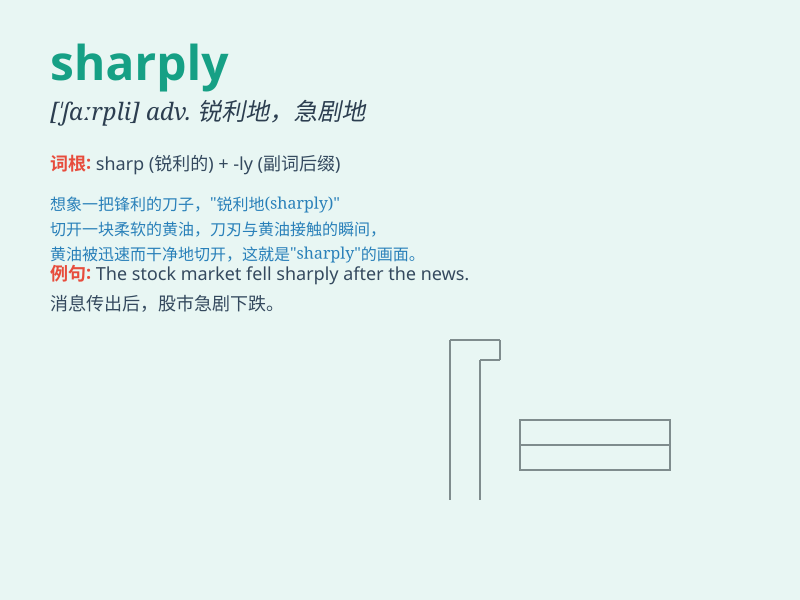

## sharply

**英音:** _[\'ʃɑ:plɪ]_ **美音:** _[\'ʃɑrpli]_

**译义:** *adv.锐利地,急剧地*

### 短语

+ **sharply increase:** _急剧增加_

+ **sharply decline:** _急剧下降_

+ **sharply criticize:** _严厉批评_

+ **sharply contrast:** _形成鲜明对比_

+ **sharply different:** _截然不同_

### 例句

#### 例句1

> **The price of the stock sharply declined.**

**中文翻译:** 这只股票的价格急剧下跌。

**单词释义:** 急剧地

#### 例句2

> **She turned sharply to face him.**

**中文翻译:** 她猛地转身面对他。

**单词释义:** 猛地

#### 例句3

> **The road curves sharply ahead.**

**中文翻译:** 前面的路急剧转弯。

**单词释义:** 急剧地

### 背诵小故事

> A sharp arrow was shot from the bow. It flew sharply through the air
and hit the target precisely. The speed and accuracy were amazing.

**一支锋利的箭从弓上射出。它急速地穿过空气，精准地射中了目标。速度和准确度令人惊叹。**

### 图义

