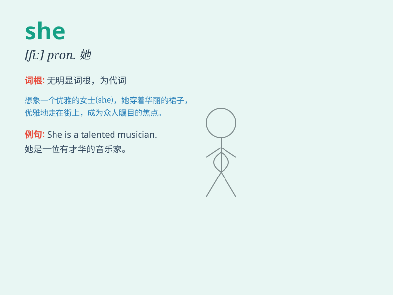

## she

**英音:** _[ʃiː]_ **美音:** _[ʃi]_

**译义:** * pron.[主格]她*

### 短语

+ **she herself:** _她自己_

+ **she is:** _她是_

+ **She said:** _她说_

+ **She knows:** _她知道_

+ **She does:** _她做_

### 例句

#### 例句1

> **She is a doctor.**

**中文翻译:** 她是一名医生。

**单词释义:** 她

#### 例句2

> **She sings very well.**

**中文翻译:** 她唱歌唱得很好。

**单词释义:** 她

#### 例句3

> **She loves reading books.**

**中文翻译:** 她喜欢读书。

**单词释义:** 她

### 背诵小故事

>
想象在一个美丽的花园中，有一朵特别的花，大家都好奇是谁在悉心照料它。原来是一位温柔的女士，她每天都会来浇水、修剪。这里的'她'就是'she'，代表着女性的'她'。

**想象在一个美丽的花园里，有一朵特别的花，大家好奇是谁在照料它。原来是一位温柔的女士，每天来照顾。这里的'她'就是'she'，表示女性的'她'。**

### 图义

