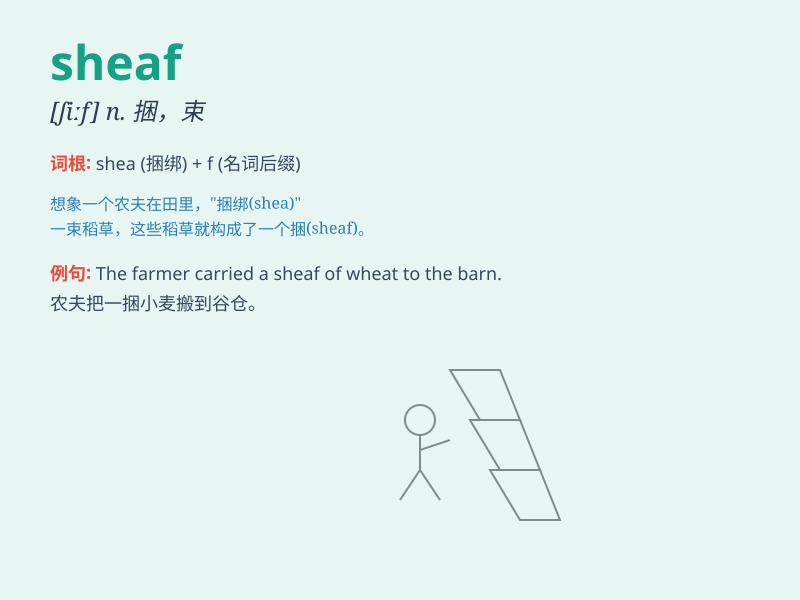

## sheaf

**英音:** _[ʃiːf]_ **美音:** _[ʃif]_

**译义:** *n.捆,束,札v.捆,束,札*

### 短语

+ **a sheaf of papers:** _一捆文件_

+ **a sheaf of arrows:** _一束箭_

+ **a sheaf of wheat:** _一捆小麦_

+ **sheaf together:** _捆在一起_

+ **bind into a sheaf:** _捆成一捆_

### 例句

#### 例句1

> **She carried a sheaf of papers under her arm.**

**中文翻译:** 她胳膊下夹着一捆文件。

**单词释义:** 一捆，一束（尤指纸、谷物）

#### 例句2

> **The farmer bound the wheat into sheaves.**

**中文翻译:** 农民把小麦捆成束。

**单词释义:** （把谷物等）捆成束

#### 例句3

> **He presented her with a sheaf of flowers.**

**中文翻译:** 他送给她一束花。

**单词释义:** 一束（花）

### 背诵小故事

> A farmer was carrying a sheaf of wheat to the barn. But it was so
heavy that he struggled. Finally, with great effort, he got it there.
Remember, a sheaf is a bundle of something, like that bundle of wheat.

**一位农民正扛着一捆小麦去谷仓。但它太重了，农民费力挣扎。最终，费了好大劲，他才把它搬到那里。记住，sheaf
就是一捆东西，就像那捆小麦。**

### 图义

