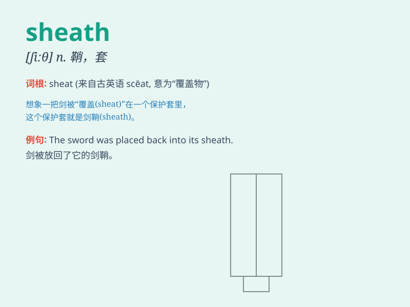

## sheath

**英音:** _[ʃiːθ]_ **美音:** _[ʃiθ]_

**译义:** *n.鞘,护套,外壳*

### 短语

+ **knife sheath:** _刀鞘_

+ **sword sheath:** _剑鞘_

+ **cable sheath:** _电缆护套_

+ **protective sheath:** _保护套_

+ **nerve sheath:** _神经鞘_

### 例句

#### 例句1

> **The knife was safely stored in its sheath.**

**中文翻译:** 这把刀安全地存放在它的刀鞘里。

**单词释义:** 刀鞘；护套

#### 例句2

> **The electrical wire is protected by a plastic sheath.**

**中文翻译:** 电线由一个塑料护套保护着。

**单词释义:** 护套；外壳

#### 例句3

> **The plant has a sheath around its stem.**

**中文翻译:** 这种植物的茎周围有一个鞘。

**单词释义:** 鞘；叶鞘

### 背诵小故事

> A brave knight was always ready for battle. Before each fight, he
carefully put his sharp sword into the sheath to protect it. The sheath
was like a safe home for the sword. Remember, sheath is that protective
cover!

**一位勇敢的骑士总是准备好战斗。每次战斗前，他都小心地把锋利的剑插入剑鞘以保护它。剑鞘就像剑的安全之家。记住，sheath
就是那个保护套！**

### 图义

