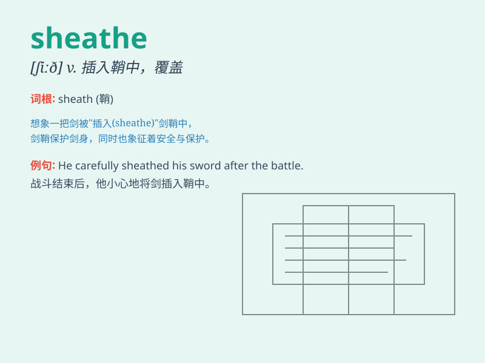

## sheathe

**英音:** _[ʃiːð]_ **美音:** _[ʃið]_

**译义:** *vt.插入鞘,覆盖*

### 短语

+ **sheathe a sword:** _把剑插入鞘中_

+ **sheathe the knife:** _给刀装上刀鞘_

+ **sheathe oneself in armour:** _给自己穿上盔甲_

+ **sheathe wires:** _给电线套上护套_

+ **sheathe cables:** _给电缆套上护套_

### 例句

#### 例句1

> **He sheathed his sword after the battle.**

**中文翻译:** 战斗结束后，他把剑插入剑鞘。

**单词释义:** 将（刀剑等）插入鞘

#### 例句2

> **The cables are sheathed in plastic to protect them.**

**中文翻译:** 电缆外面裹着塑料以保护它们。

**单词释义:** 给\...装护套

#### 例句3

> **The warrior sheathed his dagger before entering the palace.**

**中文翻译:** 这位战士在进入宫殿前将匕首入鞘。

**单词释义:** 把（刀、剑等）插入鞘

### 背诵小故事

> A brave knight was in a fierce battle. After winning, he carefully
sheathed his sword to protect it and himself. The act of putting the
sword back into its cover was called sheathe.

**一位勇敢的骑士在一场激烈的战斗中。获胜后，他小心翼翼地将剑插入剑鞘，以保护剑和自己。把剑放回剑鞘的这个动作就叫做
sheathe。**

### 图义

