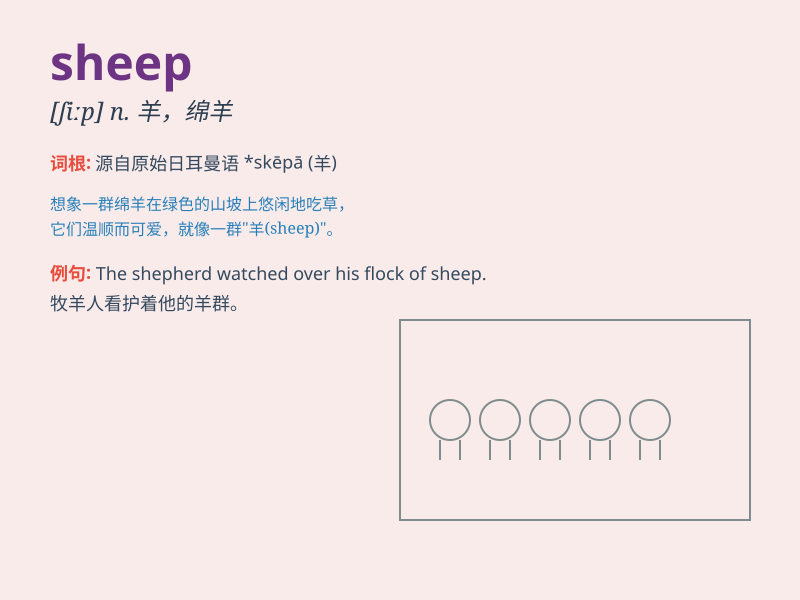

## sheep

**英音:** _[ʃiːp]_ **美音:** _[ʃip]_

**译义:** *n.羊,绵羊,羞答答的人,胆小鬼,信徒*

### 短语

+ **black sheep:** _害群之马；败家子_

+ **lost sheep:** _迷途的羔羊；误入歧途的人_

+ **sheep dog:** _牧羊犬_

+ **sheep pen:** _羊圈_

+ **sheepskin coat:** _羊皮大衣_

### 例句

#### 例句1

> **The sheep are grazing in the field.**

**中文翻译:** 绵羊正在田野里吃草。

**单词释义:** 绵羊（复数）

#### 例句2

> **Sheep provide us with wool and meat.**

**中文翻译:** 绵羊为我们提供羊毛和肉。

**单词释义:** 绵羊（复数）

#### 例句3

> **A black sheep is considered unlucky in some cultures.**

**中文翻译:** 在某些文化中，害群之马被认为是不吉利的。

**单词释义:** 绵羊（单数）；害群之马（习语中的单数）

### 背诵小故事

> One day, a little girl was lost in a big forest. She was very scared.
Suddenly, she saw a group of sheep. The sheep were so cute and friendly.
They led the girl out of the forest. The girl was very happy.

**一天，一个小女孩在大森林里迷路了。她非常害怕。突然，她看到一群羊。这些羊非常可爱和友好。它们带着女孩走出了森林。女孩非常高兴。**

### 图义

