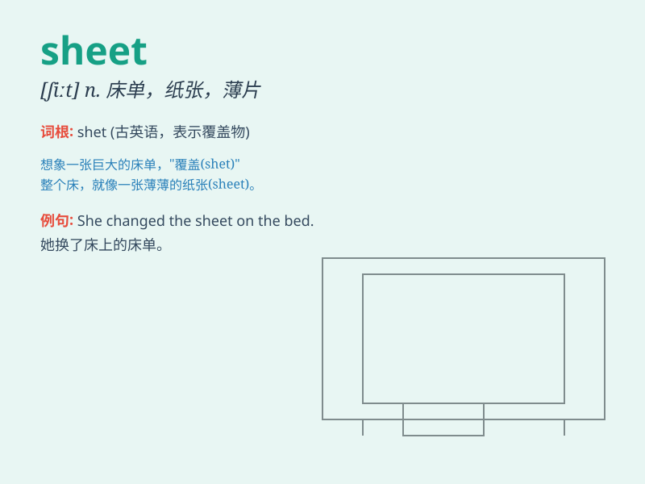

## sheet

**英音:** _[ʃiːt]_ **美音:** _[ʃit]_

**译义:** *n.(一)片,(一)张,薄片,被单,被褥*

### 短语

+ **a sheet of paper:** _一张纸_

+ **balance sheet:** _资产负债表_

+ **bed sheet:** _床单_

+ **data sheet:** _数据表_

+ **time sheet:** _考勤表_

### 例句

#### 例句1

> **The bed was covered with a clean sheet.**

**中文翻译:** 这张床铺上了干净的床单。

**单词释义:** 床单

#### 例句2

> **He filled out a sheet of paper with his personal information.**

**中文翻译:** 他在一张纸上填写了个人信息。

**单词释义:** 纸张

#### 例句3

> **A sheet of ice covered the road after the storm.**

**中文翻译:** 暴风雨过后，道路被一层冰覆盖。

**单词释义:** 一层；薄片

### 背诵小故事

>
想象一下，你在一个狂风大作的夜晚，一张白色的sheet（床单）被风从窗户吹了出去，像一个幽灵在空中飘荡。这张sheet
很薄很轻，在空中不断飞舞。

**想象在狂风夜，一张白色的床单被风从窗户吹出去，像幽灵在空中飘荡，展示床单薄轻且飞舞的样子。**

### 图义

