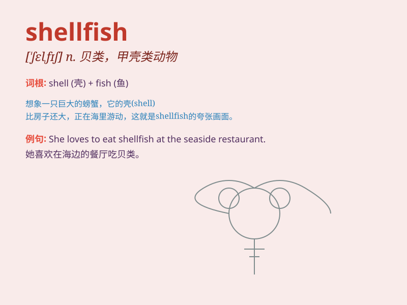

## shellfish

**英音:** _[\'ʃelfɪʃ]_ **美音:** _[\'ʃɛl\'fɪʃ]_

**译义:** *n.贝,甲壳类动物*

### 短语

+ **edible shellfish:** _可食用的贝类_

+ **marine shellfish:** _海洋贝类_

+ **shellfish farming:** _贝类养殖_

+ **shellfish poisoning:** _贝类中毒_

+ **collect shellfish:** _采集贝类_

### 例句

#### 例句1

> **I\'m allergic to shellfish.**

**中文翻译:** 我对贝类过敏。

**单词释义:** 贝类（总称）

#### 例句2

> **The restaurant offers a wide variety of shellfish.**

**中文翻译:** 这家餐厅提供各种各样的贝类。

**单词释义:** 贝类（总称）

#### 例句3

> **She loves to eat shellfish, especially oysters.**

**中文翻译:** 她喜欢吃贝类，尤其是牡蛎。

**单词释义:** 贝类（总称）

### 背诵小故事

> A little crab was walking along the beach. It was a kind of
shellfish. It had a hard shell to protect itself. One day, it found a
beautiful shell and thought it was a new home. How funny!

**一只小螃蟹正在海滩上走着。它是一种贝类。它有坚硬的壳来保护自己。有一天，它发现了一个漂亮的贝壳，还以为那是一个新家。多有趣呀！**

### 图义

